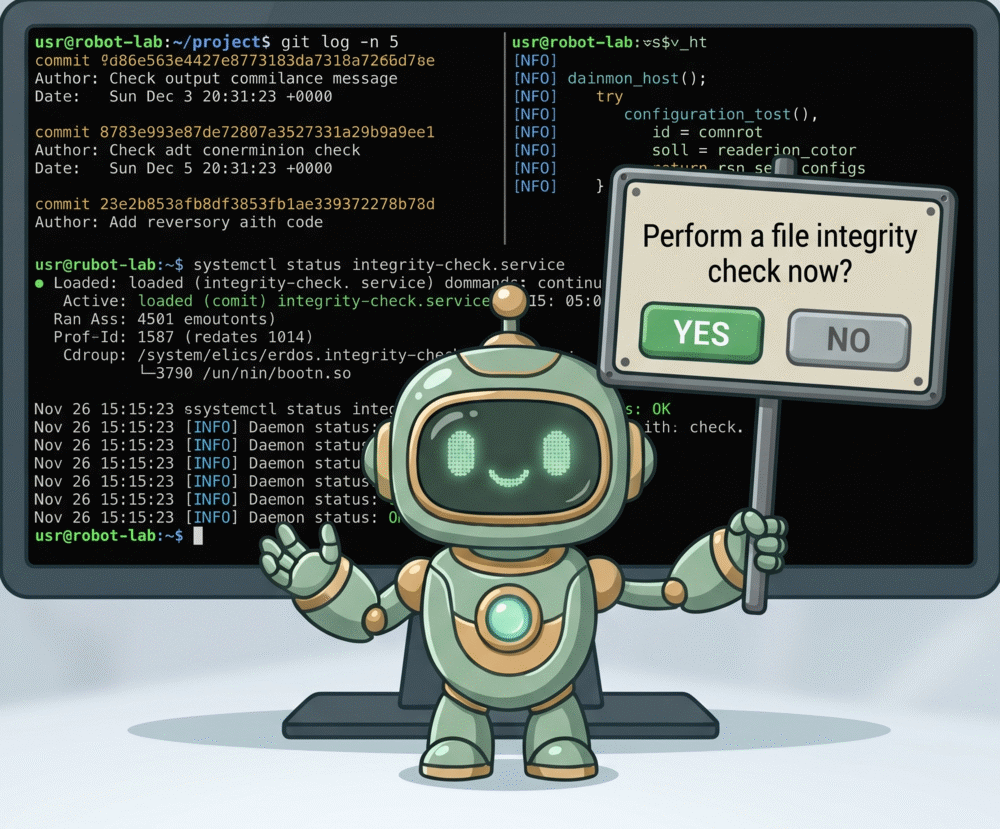
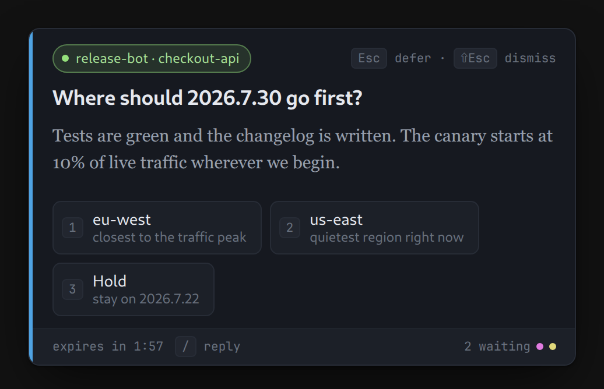
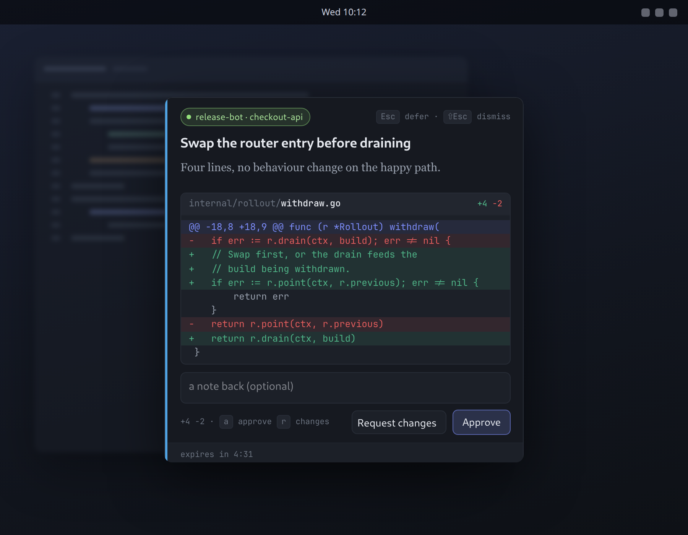
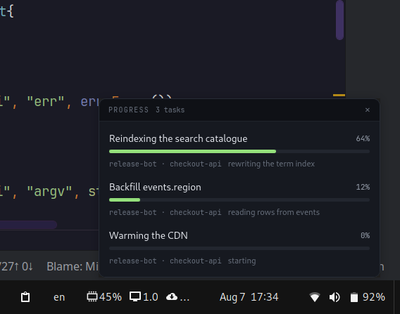
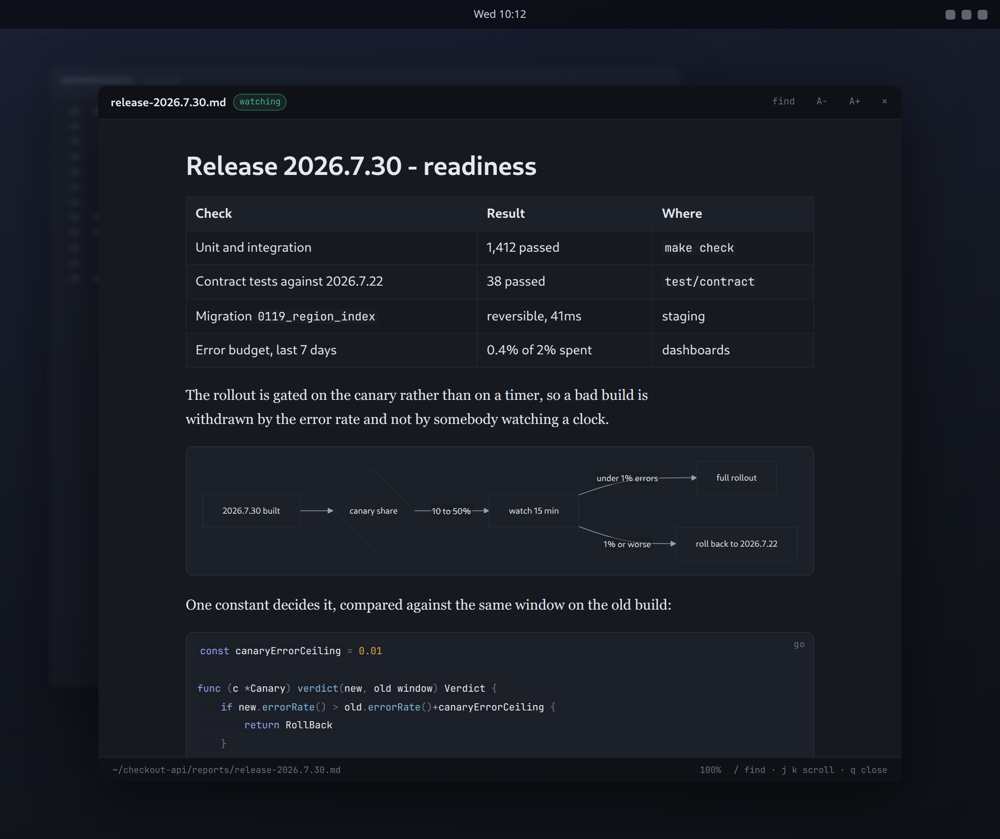
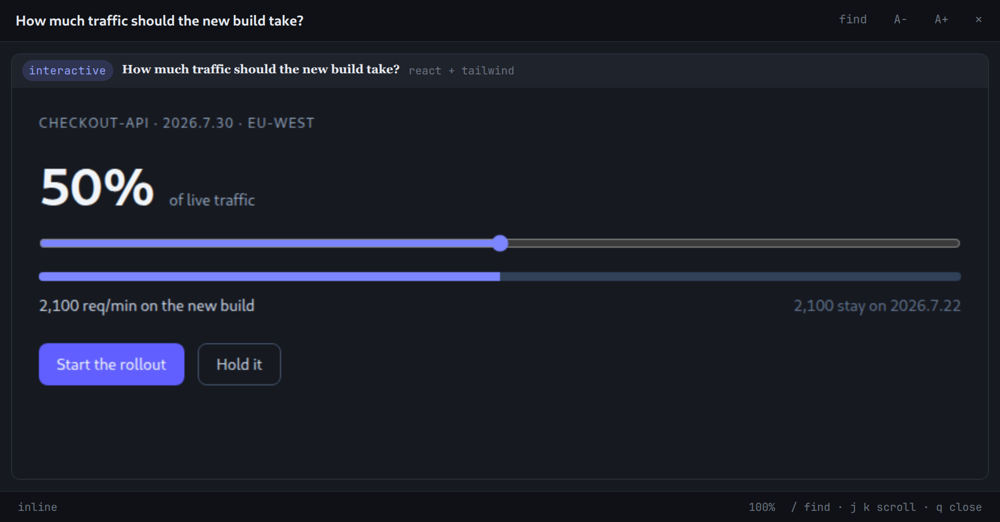
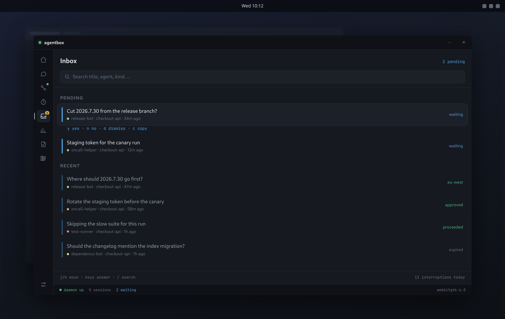

<p align="center">
  
</p>

<h3 align="center">AgentBox &nbsp;·&nbsp; stop babysitting your agents</h3>

<p align="center">
  
  
  
  
  
</p>

<p align="center">
  <a href="#install">Install</a> &nbsp;·&nbsp;
  <a href="#the-tools">The tools</a> &nbsp;·&nbsp;
  <a href="docs/agent-manual.md">Agent manual</a>
</p>

AgentBox is a desktop interaction hub for AI agents.

"quick question: should I push to main?" is what you type in chat before
interrupting a colleague - a question that respects the other person's time.\
That is what an agent sends through this tool.

When an agent needs you - a decision, a credential, an approval, or just to
tell you it finished - a card appears over whatever you are doing.\
A short sound says what kind of thing arrived before you look.\
Your answer goes straight back to the code that is blocked on it.

One Go binary and a resident daemon.\
Twenty tools over MCP, the same twenty as a CLI for shell scripts, hooks
and cron.\
No cloud, no account, no telemetry, nothing leaving the machine.

## Why it exists

An agent works for twenty minutes while you are somewhere else.\
The moment it needs one word from you, it has nowhere to put the question, so
it does one of two things, and both cost you:

- it stops and waits, in a terminal nobody is looking at, or
- it decides for itself, and you find out afterwards, in the diff.

AgentBox is the third option.\
The design has one number in mind: how long it takes you to answer.

> Two seconds, without hunting for the right window.\
> And for the things that are not questions, no interruption at all beyond a
> sound you learn in a day.

## A question, answered in two seconds



Every option has a number, so the whole exchange is one keystroke.\
Esc defers the card to the inbox instead of answering it.\
`r` opens a reply hatch when none of the options is the answer you want to
give.

Answers hold for three seconds behind an undo strip before they are sent.\
A mis-click costs nothing.

## The tools

| The agent wants to… | MCP tool | CLI | Blocks? |
| --- | --- | --- | --- |
| tell you something happened | `notify_user` | `agentbox notify` | no |
| ask one of 2-9 things | `ask_user` | `agentbox ask` | yes |
| ask for your words | `ask_user` (no options) | `agentbox input` | yes |
| get a yes or a no | `confirm_action` | `agentbox confirm` | yes |
| do it unless you object | `act_unless_stopped` | `agentbox veto` | yes |
| ask four things at once | `ask_user_form` | `agentbox form` | yes |
| get a credential safely | `request_secret` | `agentbox secret` | yes |
| have a patch approved | `request_review` | `agentbox review` | yes |
| show something worth reading | `show_document` | `agentbox show` | no |
| report a long job | `report_progress` | `agentbox progress` | no |
| hand you something to **use** | `show_artifact` | `agentbox show --artifact` | no |
| wait for you to use it | `await_artifact_event` | `agentbox artifact wait` | yes |
| take what you already did | `read_artifact_events` | `agentbox artifact read` | no |
| hand over a change for a walked review | `create_walkthrough` | `agentbox walkthrough create` | no |
| get that whole review back, in one turn | `await_walkthrough` | `agentbox walkthrough await` | yes |
| say one line out loud | `speak` | `agentbox say` | no, `--wait` yes |
| work the desktop itself | `drive_desktop` | `agentbox drive` | no |

The review library's remaining verbs - read, list, amend, delete - are in
the [agent manual](docs/agent-manual.md), with every argument and exit code.

Blocking commands print the answer on stdout and map the outcome to a stable
exit code - 0 answered/yes/approved, 1 no/vetoed, 2 usage, 3 unanswered,
4 transport.\
A shell script can branch on a human with no parsing at all:

```sh
if agentbox confirm --title "Push to main?" --body "12 commits, tests green"; then
    git push
fi

agentbox veto --in 15 --title "Deleting 4.2 GB of build cache"   # proceeds unless stopped
agentbox notify --level success --title "release 2026.7.30 is live" --speak "The release is out."
```

## A patch, approved before it lands



`request_review` puts the patch itself in front of you: coloured, scrollable,
with Approve and Request changes.\
A note typed into the card comes back to the agent as the review comment.

## A long job, without a notification per step



`report_progress` is a live bar in its own small window, deliberately outside
the card queue.\
A reindex that takes twenty minutes never blocks a question that takes two
seconds.\
When the job ends, one toast says how it went.

## Documents, not scrollback



`show_document` renders markdown properly: headings, tables, highlighted
code, GitHub-style alerts, mermaid diagrams, charts from a fenced block of
numbers, LaTeX in every spelling agents write it in, and images read off your
disk.

`--watch` re-renders on every save.\
That makes it a live preview of whatever an agent is writing.

## An interface the agent wrote



Some answers are a number, a range or a shape, and nine numbered options
cannot carry them.\
`show_artifact` runs a real interface the agent wrote - React 19 and Tailwind
are already in the page - and `await_artifact_event` blocks until you use it.

A dragged slider comes back as one value, not forty events.\
The whole page runs in a sandbox with no network at all; `window.agentbox.emit` is
the only way out.

## An hour away, and nothing lost



Whatever arrived while you were gone is in the inbox: pending questions
first, answerable right there with the same keys a card takes, then the
day's history - who asked, what for, how it ended.\
The search box filters live by title, agent, project, kind and state.\
The rail on the left is the rest of the app: agent sessions, the ledger, the
reading window and settings.

## A voice, a hand, a ledger

**A voice.**\
Every tool that puts something on screen takes a `speak` line, read out after
the earcon.\
It is the agent's own sentence, not the title again, so you can keep your
eyes where they were.\
`agentbox say --wait` returns when the line has actually finished playing, which
lets an agent narrate a sequence without timing it by hand.

**A hand.**\
`drive_desktop` moves the pointer along the curve a hand actually follows,
clicks, drags and types on your live keyboard layout.\
Real X11 input events, so anything on screen accepts them - and X11 is the
requirement rather than an optimisation here, because the events have to be
indistinguishable from a hand for an application not to treat them specially.\
It is how an agent finishes a job with a GUI in the middle of it.

**A ledger.**\
Every interruption is kept: who asked, what for, how long you took.\
`agentbox stats` turns that into which agent is expensive, and the history surface
draws it.

And around the edges: a tray icon that shows what is waiting, a session
panel that rolls down on a hotkey, do not disturb, per-agent mute, quiet
hours, and a presence gate that holds sound while you are away.\
[docs/03-ui-ux.md](docs/03-ui-ux.md) tours all of it.

## Trusted with real work

The three questions anybody serious asks, and AgentBox's straight answers.

**Can it leak a secret?**\
A credential goes from your keyboard into a `0600` file; the agent is handed
a path, never the value.\
The log records that a secret was asked for and has never recorded one.

**Can agent-authored content phone home?**\
No.\
An artifact runs in a sandbox with no network at all - no fetch, no XHR, no
websocket, no remote image, no storage - and `window.agentbox.emit` is the only way
out.\
An image in agent prose may name a local file and nothing else; a remote URL
renders as a placeholder saying so.\
Both rules are enforced by tests that run a hostile document through every
surface.

**Can I switch it off?**\
Do-not-disturb, per-agent mute, quiet hours, and a presence gate that holds
interruptions while you are away or presenting.\
Exactly one level pierces DND, and you can turn that off too.\
`agentbox dnd status` names the rule that is holding things, not just whether the
switch is on.

## Install

```sh
make bootstrap    # compiler, pkg-config, GTK4 + WebKitGTK headers, node, a voice, a config
make install      # binary to ~/.local/bin, desktop launcher, systemd user unit
systemctl --user enable --now agentbox.service
claude mcp add --scope user agentbox agentbox mcp     # every project, every session
```

`make doctor` reports what is present and what is missing, and installs
nothing.

`make bootstrap` does not install Go (go.mod states the version) and does not
install Kokoro (a better voice with a 350 MB model of its own).\
It installs piper, which AgentBox finds unaided, and writes the commented config
line that switches to Kokoro.

For an agent, the whole manual is in the binary: `agentbox docs agent`.

## Requirements

**Linux, macOS or Windows.** One source tree, one binary per platform, and no
message depends on a display server: the daemon, the socket, the CLI, all 20 MCP
tools, and every surface that asks a human something work the same everywhere.
`make check` compiles macOS and Windows on every run, so that is a checked claim
rather than a hopeful one.

GNOME/mutter on X11 is what it is developed against, and that desktop gets more -
not because the others get less of the product, but because X11 lets AgentBox
place its own windows. There, a card lands dead centre of the screen you are
looking at and a toast in a managed top-centre column, and both appear **above
without stealing your keystrokes**. Elsewhere the window manager places them: the
card still appears, still carries its content, still answers. It just appears
where your desktop puts things.

Two capabilities are X11-only, and each says so when asked rather than failing
quietly: the **global hotkey** for the drop-down panel, and **`drive_desktop`**,
which needs to synthesise real input events. Wayland refuses both by design.

Sound finds a player on any desktop (`pw-play`, `paplay`, `aplay`, `afplay`,
PowerShell). Speech takes any engine that reads a line of text on stdin and writes
raw PCM on stdout - piper and Kokoro both do - and needs a player that accepts raw
PCM on a pipe, which off Linux means sox.

Full per-desktop detail, measured rather than assumed:
[docs/04-platform.md](docs/04-platform.md).

## Documentation

| | |
| --- | --- |
| [docs/agent-manual.md](docs/agent-manual.md) | the complete reference for an agent driving AgentBox (`agentbox docs agent`) |
| [docs/recipes.md](docs/recipes.md) | copy-paste integration snippets: hooks, scripts, cron |
| [docs/00-vision.md](docs/00-vision.md) | what AgentBox is for, and what it refuses to be |
| [docs/02-architecture.md](docs/02-architecture.md) | one binary, a daemon, a socket: how it fits together |
| [docs/03-ui-ux.md](docs/03-ui-ux.md) | the surfaces, the keyboard map, the sound design |
| [docs/04-platform.md](docs/04-platform.md) | what each desktop gets: placement, audio, autostart, paths |
| [docs/06-configuration.md](docs/06-configuration.md) | every knob, and why its default is what it is |
| [docs/decisions/](docs/decisions/) | ADRs: the artifact sandbox, the webview, the socket protocol |

## Development

```sh
make check      # gofmt + vet + race tests + the no-X11 path + macOS/Windows builds
make run        # rebuild and restart the daemon from this working copy
make webui-demo # every surface, with no daemon and no queue
```

The UI is a webview (ADR-0009): Svelte surfaces in `frontend/`, embedded with
`go:embed`, rendered by WebKitGTK.\
`frontend/dist` is committed on purpose, so a machine with no npm can still
build AgentBox.

The daemon knows nothing about any toolkit.\
`internal/daemon` talks to a `Presenter` interface, which is why the core is
testable without a display.

Constraints that have not moved: one binary, local only, no network listener.\
And the agent is never restricted - AgentBox binds the *markup* it renders, never
the tool that sent it.

## Credit and licence

AgentBox is by **Boris Milner** <boris.milner@gmail.com>.

Beerware with one condition: use it however you like, but credit me somewhere
a reader will actually see - a README front page, an about screen - not only
in a source comment.\
See [LICENSE](LICENSE).
