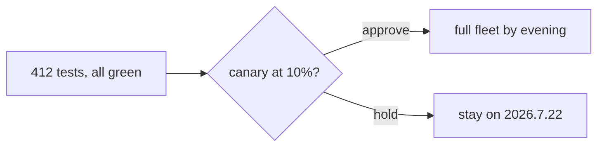

# Release report - checkout-api 2026.7.30

`test-runner` asked AgentBox to open this page. Everything on it is plain markdown
from an agent: typeset mathematics, a diagram, a chart, and code.

## The error budget, checked

The service promises 99.9% availability; what matters is how fast a release
burns the rest. Yesterday closed at 99.97%, so the burn rate

$$
B \;=\; \frac{1 - A_\text{observed}}{1 - A_\text{target}} \;=\; 0.3
$$

leaves room to spare, and the canary held $p_{95}$ at 182 ms through the
peak. Prices stay prices: $8 a seat and $96 a year survive as money.

## The path to the fleet



## Who asked, and who got answered

```chart
{"type": "bar", "title": "Interruptions this release, by agent",
 "x": ["release-bot","test-runner","dependency-bot","oncall-helper"],
 "series": [{"name": "asked", "values": [3, 9, 9, 2]},
            {"name": "answered", "values": [3, 8, 9, 2]}]}
```

## The fix that shipped

```go
// p95 at the payment provider is 1.8s on a busy day; a 2s cut-off was
// failing real payments. Retry once, then fail loudly.
func New(base string) *Client {
    return &Client{
        base:    base,
        http:    &http.Client{Timeout: 8 * time.Second},
        retries: 1,
    }
}
```
