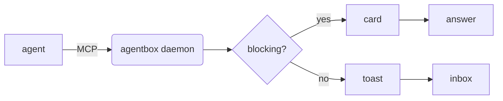
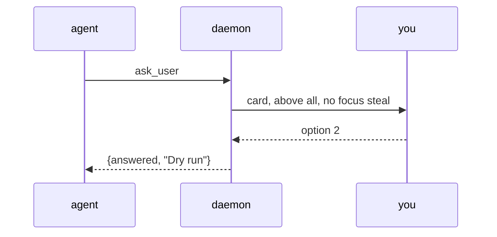

# AgentBox markdown sample

A document to eyeball the M6 engine: run `agentbox show docs/sample.md --watch`
and edit it live. It exercises every block the renderer handles.

## Inline styles

Text can be **bold**, *italic*, ~~struck~~, `inline code`, and a
[link](https://example.com). Mix them: a **bold `code` run** still reads.

## Lists

- plain bullet
- nested ideas
  - second level
- [x] a finished task
- [ ] an open task

1. first
2. second
3. third

## Alerts

> [!NOTE]
> A neutral aside.

> [!TIP]
> Prefer `act_unless_stopped` when proceeding is the expected outcome.

> [!IMPORTANT]
> The daemon owns every deadline; a surface only counts down to it.

> [!WARNING]
> This step is destructive.

> [!CAUTION]
> Force-pushing rewrites history for everyone on the branch.

A plain quote is still a plain quote:

> Agents ask; you answer.

## Footnotes and definitions

Escalation replays the earcon[^1] rather than stacking windows.

[^1]: A short tone per severity class, not a per-agent signature (FR46 was
      dropped as redundant).

AgentBox
: the tool an agent asks with

card
: one window, one question, answerable in under two seconds

## Code

```go
func main() {
	// chroma highlights this, dark and light
	fmt.Println("agentbox")
}
```

## Table

| Command | Blocks? | Notes               |
| :------ | :-----: | ------------------: |
| notify  | no      | fire and forget     |
| ask     | yes     | 2-9 options         |
| veto    | yes     | acts unless stopped |

## Chart

```chart
{"type": "bar", "title": "Interruptions by day",
 "x": ["Mon","Tue","Wed","Thu","Fri"],
 "series": [{"name": "asks", "values": [4, 7, 3, 8, 2]},
            {"name": "vetoes", "values": [1, 2, 0, 3, 1]}]}
```

```chart
{"type": "line", "title": "Latency (ms)",
 "x": ["v1","v2","v3","v4"],
 "series": [{"name": "p50", "values": [120, 90, 80, 60]},
            {"name": "p99", "values": [400, 350, 300, 210]}]}
```

```chart
{"type": "area", "title": "Queue depth",
 "x": ["09:00","10:00","11:00","12:00","13:00","14:00"],
 "series": [{"name": "pending", "values": [0, 3, 7, 4, 9, 2]}]}
```

```chart
{"type": "scatter", "title": "Answer time vs options",
 "x": ["2","3","4","5","6","7"],
 "series": [{"name": "seconds", "values": [3, 5, 4, 9, 12, 11]}]}
```

```chart
{"type": "pie", "title": "Interruptions by agent",
 "x": ["claude-code","codex","nudge"],
 "series": [{"values": [38, 19, 6]}]}
```

```chart
{"type": "doughnut", "title": "Outcomes",
 "x": ["answered","expired","dismissed"],
 "series": [{"values": [34, 5, 2]}]}
```

## Diagrams





## A longer listing

Blocks past ten lines carry line numbers, and every block has a copy button.

```python
def escalate(item, cadence, cap):
    """Replay the earcon until the item is answered or the cap is reached."""
    played = 0
    while not item.answered and played < cap:
        sleep(cadence)
        if item.answered:
            break
        play(earcon_for(item.level))
        played += 1
    return played
```

## An interactive artifact

An `artifact` fence is markup to run rather than markup to read. It goes into a
sandbox with no network and no reach into AgentBox, and the code tab shows exactly
what is running (M10).

```artifact
<div style="font:14px/1.6 system-ui;padding:14px 16px">
  <p style="margin:0 0 10px">How many rows per batch?</p>
  <input id="n" type="range" min="50" max="2000" step="50" value="500" style="width:100%">
  <p style="margin:10px 0 0;font:12px ui-monospace,monospace;opacity:.7">
    <span id="v">500</span> rows ·
    <button id="go" type="button">tell the agent</button>
    <span id="said"></span>
  </p>
  <script>
    const n = document.getElementById("n");
    const show = () => (document.getElementById("v").textContent = n.value);
    n.addEventListener("input", show);
    document.getElementById("go").addEventListener("click", () => {
      window.agentbox?.emit("batch", { rows: Number(n.value) });
      document.getElementById("said").textContent = "· sent";
    });
    show();
  </script>
</div>
```

---

That horizontal rule and this closing paragraph end the sample.

## Math

Inline first: the mass-energy relation is $E = mc^2$, and a sum written mid
sentence, \(\sum_{i=1}^{n} i = \tfrac{n(n+1)}{2}\), keeps the line it was
written in. Prices are not formulas, so this build cost $5 and that one $10.

Display math interrupts a paragraph without needing a blank line first:

$$
\int_0^1 x^2 \, dx = \frac{1}{3}
\qquad
\mathcal{L} = -\frac{1}{4} F_{\mu\nu} F^{\mu\nu} + i\bar\psi\gamma^\mu D_\mu\psi
$$

The other three spellings render identically. A `\[ \]` block:

\[
\begin{aligned}
  a^2 + b^2 &= c^2 \\
  e^{i\pi} + 1 &= 0
\end{aligned}
\]

And a fence, for an agent that would rather be explicit than count dollars:

```math
\hat{H}\,\psi = E\,\psi
```

## Images

An image AgentBox will show has to arrive as bytes it can vouch for. A `data:` URI
is inlined under the same ceiling and the same sniff as a file:


A local file works the same way, given an absolute path: AgentBox reads it, checks
it really is a PNG, JPEG, GIF or WebP, and hands the surface bytes rather than a
path.

A relative path works too, in a document AgentBox opened from disk - it reads
against the file's own directory, so this is AgentBox's own icon two directories
over, written the way you would write it in any editor:


The same line in a card body or an agent's turn is refused instead: prose on the
socket has no directory of its own, and the daemon's is not the agent's.

Everything else says so instead of loading. A remote host is never fetched,
because that would be a request on an agent's behalf to somewhere you never saw:


And a path that resolves to nothing says where it looked:


