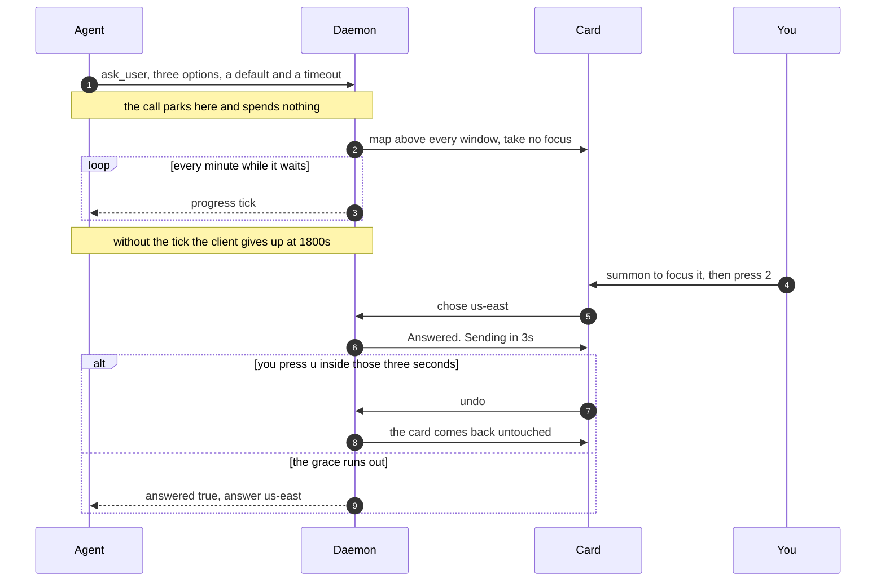
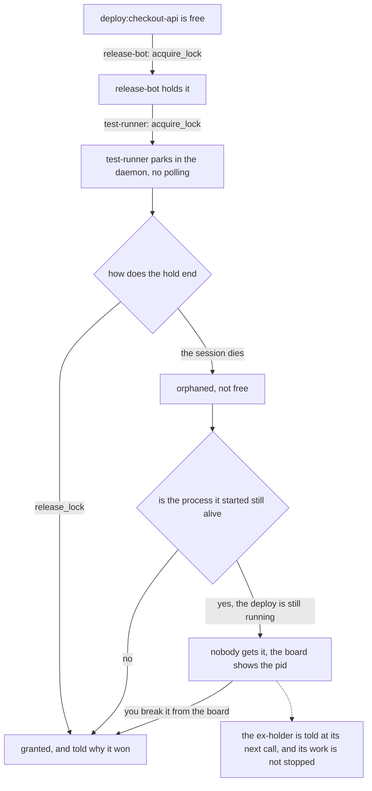

# The AgentBox wiki: design

This decides the shape, the reading order, the page template and the house voice
for the AgentBox wiki. It is not the wiki. A writer works from here, page by
page, and two finished pages are attached at the end as the standard everything
else is measured against.

Everything below assumes the portable markdown subset: `[[Text|slug]]` links,
hand-written anchor lists, mermaid, KaTeX, GitHub-style alerts, `<details>`,
tables, task lists, fenced code, `<kbd>` `<sub>` `<sup>`, and images by absolute
raw URL. Flat lowercase-hyphenated filenames at the wiki root, no nesting, no
`[[_TOC_]]`, no footnotes, no front matter.

The one thing to hold on to: **the reader has not decided to care yet.** Almost
nobody arriving here believes an AI agent can be left running unattended. The
wiki's job is not to document AgentBox. It is to make that person believe it,
and then not waste their time.

---

## 1. Page inventory

Eighteen pages. One landing page, three that convert, ten features, four
reference.

| File | Its one job | Read | For |
|---|---|---|---|
| `home.md` | The ninety-second decision: the problem, the card, the trust answer, the honest limit | 2 min | 1 |
| `the-card.md` | What a question looks like on screen, and why it never takes your keyboard | 4 min | 1, 3 |
| `notifications.md` | The five levels, the six sounds, the spoken line, and the progress window that is not a card | 3 min | 1, 3 |
| `is-it-safe.md` | The three questions an evaluator asks, each answered with the thing that enforces it | 4 min | 2 |
| `install.md` | From nothing to a real card on your screen, and how to tell it worked | 3 min | 1, 2 |
| `nothing-gets-lost.md` | Where a question goes when you were not there for it | 3 min | 1, 3 |
| `staying-quiet.md` | Every way to make it shut up, and the one level that still gets through | 3 min | 2, 1 |
| `documents-and-artifacts.md` | Reading windows, charts, maths, and interfaces an agent wrote and you use | 4 min | 1, 3 |
| `review-board.md` | A change you walk at your own pace and hand back in one turn. Do not sell amendment: `amend_walkthrough` is registered and always refuses | 5 min | 1, 3 |
| `agents-board.md` | One screen that says which of your agents needs you and which is stuck | 3 min | 1 |
| `taking-turns.md` | Locks, signals and a shared blackboard, so you stop being the mutex | 5 min | 1, 3 |
| `hands-off.md` | When an agent needs your mouse, and how you take it back mid-run | 4 min | 1, 2 |
| `sessions.md` | Agents running inside AgentBox, and the console that rolls down on a hotkey | 3 min | 1 |
| `assignments.md` | Work AgentBox starts on its own, on a schedule, and reports on | 3 min | 1 |
| `what-agents-can-do.md` | Every tool, one row each, and the door to the real reference | 4 min | 3 |
| `settings.md` | The knobs worth knowing and why each default is what it is | 4 min | 2, 3 |
| `limits.md` | Linux and X11, and the things it refuses to become | 2 min | 2 |
| `glossary.md` | Agent, MCP, daemon, card, item, area, in words a non-developer can use | 2 min | all |

Readers: **1** the developer or lead who is not convinced yet, **2** whoever has
to approve this on a work machine, **3** the existing user looking something up.

### The ninety-second path

`home.md`, and nothing else. Its hurry block is the first twenty seconds, the
problem and the card carry the next seventy, and by the end of "This is what
arrives" the reader has decided. Everything after that on the page is for
somebody who has already said yes and is now looking for a reason to say no.

Then, because every page opens with the same fixed block, the reader who wants
thirty more seconds gets a second and third page for free: the hurry blocks of
`the-card.md` and `is-it-safe.md`. That composition is deliberate. Reading only
the hurry blocks of the sidebar's first two groups is a two-minute tour of the
whole product, and it is the tour to send somebody who asked "what is this
thing" in a chat window.

### The thirty-minute path

In order, and it is the order of the sidebar for exactly this reason:

`home` -> `the-card` -> `notifications` -> `nothing-gets-lost` ->
`staying-quiet` -> `is-it-safe` -> `agents-board` -> `review-board` -> `install`

Two minutes plus four plus three plus three plus three plus four plus three plus
five plus three is thirty. That path answers, in order: what is the problem, what
does answering feel like, what about the noise, what if I am away, how do I make
it stop, is it safe, what about five agents at once, what is the best thing it
does, and how do I get it. A reader who finishes it has seen every argument and
no reference material.

### Why eighteen

The count comes from one rule: **a page exists for each thing a person can ask
for by name.** "Is it safe on my work laptop", "how do I make it stop
interrupting me", "what happens when two agents fight over my repo", "what did
it ask me while I was in that meeting". Each of those is a sentence somebody says
out loud, and each gets a page whose title is nearly that sentence.

Fewer than eighteen means welding two of those questions together, and the
casualty is always the second one: a page called "Notifications and quiet hours"
sells the sound design and buries the off switch, and the off switch is what
reader 2 came for. More than eighteen means splitting a feature across pages, and
then no page can answer its own question without three links.

The rule for adding a nineteenth: **a page is born when two features start
stealing each other's hurry block**, not when a feature ships. If the summary of
`sessions.md` has to spend a sentence on assignments to make sense, they were one
page. If it does not, they were two.

Two pages are load-bearing beyond their size. `home.md` is the whole funnel;
budget as much attention on it as on any five others. `glossary.md` is what lets
every other page skip its definitions, which is how the pages stay short enough
for a non-developer to finish.

### Shipping rules

- **Flat, lowercase, hyphenated, `.md`.** GitHub flattens any path to its
  basename, so a nested file silently collides. No page may be named anything a
  reader cannot guess from the sidebar label.
- **Three files ship twice.** The sidebar as `_sidebar.md` and `_Sidebar.md`
  (GitLab reads the first, GitHub the second), and the landing page as `home.md`
  and `Home.md` (same split). Byte-identical copies, made by the publish step,
  never edited separately:

  ```sh
  cp _sidebar.md _Sidebar.md
  cp home.md Home.md
  ```

  The seam this leaves: on GitHub a `[[Label|home]]` link opens the lowercase copy
  rather than the front page. Same content, different URL. Accepted, because the
  alternative is a stub as GitHub's front page.
- **Link with `[[Label|slug]]`, always.** Never a bare `[[slug]]`, because the
  slug is not a sentence, and never a relative markdown link, because the two
  platforms resolve those differently.
- **Images by one absolute raw URL base**, set once:
  `https://gitlab.com/fu-bar/agentbox/-/raw/main/docs/wiki/img/`. Before writing
  a single ``, open one of those URLs in a private window. If it 404s the
  project is not public and repo-hosted images cannot work on both platforms; the
  fallback is to commit images into the published platform's own wiki repo and
  accept that exactly one line per page differs between platforms.
- **Alt text carries the point, not the filename.** Every image must degrade to
  a sentence that does the image's job, because on a bad network or a private
  repo that sentence is the page.
- **Pages are written in `docs/wiki/pages/` and published to the wiki root.** The
  repo is where they are reviewed and versioned; the wiki is a publish target. The
  flat-filename rule applies to the files in `pages/`, since those names become the
  wiki's own.
- **Prose comes from nowhere but the writer. Facts come from nowhere but
  `docs/wiki/FACTS.md`.** That file was audited out of the source at commit
  `69230d4` and it lists what the repo's own documents get wrong: the tool count
  (thirty-nine, not fourteen and not twenty), the two `--tab` values that are not
  surfaces, five config knobs that are parsed and read by nothing, and Wayland. If
  a claim is not in FACTS.md, either it is not a fact or it has not been checked
  yet. Do not resolve a disagreement by picking the doc that sounds more
  confident.
- **Nothing in the wiki is copied from the repo docs.** The wiki is written for a
  stranger; `docs/` is written for the next session. Lifting a paragraph across is
  how a wiki starts sounding like a changelog.

---

## 2. The sidebar

Verbatim, both files. Group headings are bold text rather than headings so the
sidebar has no giant type. Labels are capped at 28 characters, because the
sidebar column is narrow and a label that wraps to three lines reads as a
paragraph.

```markdown
**AgentBox**

- [[What it is|home]]

**Decide in five minutes**

- [[A question on screen|the-card]]
- [[Sound and speech|notifications]]
- [[Safe on a work machine?|is-it-safe]]
- [[Install|install]]

**Living with it**

- [[Away, and nothing lost|nothing-gets-lost]]
- [[When it stays quiet|staying-quiet]]
- [[Documents and artifacts|documents-and-artifacts]]
- [[Reviews you walk|review-board]]

**Several agents at once**

- [[Who needs you now|agents-board]]
- [[Taking turns|taking-turns]]
- [[Hands off the desktop|hands-off]]

**AgentBox runs agents too**

- [[Sessions and the panel|sessions]]
- [[Work it does on its own|assignments]]

**Look it up**

- [[What an agent can do|what-agents-can-do]]
- [[Settings and defaults|settings]]
- [[Limits and non-goals|limits]]
- [[Words used here|glossary]]

<sub>The agent-facing reference is not here. It ships inside the binary:
`agentbox docs agent`.</sub>
```

The order is the thirty-minute path with the reference material swept to the
bottom. Alphabetical would put `agents-board` first, which is the page a reader
understands last.

---

## 3. The page template

Fixed at the top, fixed at the bottom, disciplined in the middle. The top and
bottom are identical on all eighteen pages so a reader learns them once. The
middle is deliberately not a skeleton, and there is a rule below that makes a
skeleton impossible.

### The hurry block

The one thing every page has. It is called **the hurry block** in this document
and it carries no heading of its own on the page.

Exact form:

````markdown
# <A claim or a promise, sentence case, never the slug re-spelled>

> **In short.** <Sentence one: what this is, in plain words.> <Sentence two: why
> it is built that way, or what it buys you.> <Optional sentence three: the one
> fact a sceptic needs.>
>
> **Read on if** <the specific thing the body delivers>. **Skip to**
> [[Label|slug]]<, or [[Label|slug]]>.
````

Rules, all of them enforceable by reading:

- **Position:** immediately after the H1. Before any image, any table, any
  contents list. Nothing goes above it.
- **Length:** two or three sentences, 55 words maximum. If it does not fit on a
  phone screen without scrolling it is too long.
- **First words are always `**In short.**`** followed by the summary in the same
  voice as the body. Not a label, not a colon-list, not a bulleted digest.
- **The router line is one line** and always has both halves: "Read on if" tells
  a reader they can leave, "Skip to" tells them where. One or two links, never
  three.
- **It is a blockquote, not an alert.** `> [!NOTE]` is reserved for real warnings
  inside the body; spending it on every page's summary would burn the alert
  vocabulary and make the genuine ones invisible. A plain blockquote already
  renders as a distinct band on both platforms with no CSS.
- **It must be true on its own.** If the summary needs the body to make sense it
  is a teaser, and a teaser wastes the twenty seconds this block exists to serve.

Why an H1 at all, when both platforms already print the page title: the printed
title is the slug, and `nothing-gets-lost` is not a sentence. The H1 is where the
page gets to make a claim. It also means the file still reads correctly in the
repo, in a raw view, and in a diff.

### The body

Three rules, and the first one is what keeps this template from producing a
uniform wiki:

1. **No two pages may share a body heading, ever, except `Next`.** No page has an
   "Overview", because then every page would. Every H2 is a specific claim about
   the thing on that page: "It will not take your keyboard, and that is the whole
   design", not "Focus behaviour". If a heading could be lifted onto another page
   unchanged, it is wrong.
2. **Somewhere in the middle, one section is the rationale**, and it is usually
   the best section on the page. It says why the thing is shaped the way it is,
   and where possible it says what went wrong before it was. That section is the
   difference between this wiki and a manual.
3. **Four to six H2s.** Under four and the page is a wall. Over six and it is a
   list of stubs. H3 only where an H2 has two or more genuinely parallel
   subparts, and never a lone H3.

### The close

The last line of every page is a link. Not a summary, not a recap, not "in
conclusion". The reader is at the bottom because they finished; the only useful
thing left is where to go.

```markdown
**Next:** [[the thing they now want|slug]], or [[the escape hatch|slug]].
```

Phrase it as what the reader wants, in lower case, not as the target page's
title. "Next: what happens to a question you were not there for" beats "Next:
Nothing gets lost".

### Variant: a feature page

Ten of the eighteen. The job is to make one feature desirable and understood,
with the rationale carrying the middle.

````markdown
# <Claim about the feature>

> **In short.** ...
>
> **Read on if** ... **Skip to** [[Label|slug]]


<sub><The one thing to notice in the shot.></sub>

## <What it is, stated as what you see or do>

Prose. Two to four short paragraphs, uneven. The mechanics that a person would
notice, none that only a maintainer would.

## <Why it is that way: the rationale section, and the best one on the page>

The decision, the alternative that was rejected, and what it cost to find out.
This is where the story goes: a date, a number, a complaint in somebody's own
words. Never invent one.

## <A specific mechanism, named concretely>

A table if every row answers the same question in the same columns. A mermaid
diagram if the reader has to hold an order or a branch in their head. Prose
otherwise.

## <What it costs, or what it will not do>

Every feature page has one of these and it is never at the top. Honest limits
are the cheapest trust in the wiki.

**Next:** [[Label|slug]], or [[Label|slug]].
````

### Variant: a concept page

`home`, `is-it-safe`, `staying-quiet`, `limits`, `glossary`. The job is to answer
one question a person asks out loud, so the H2s are its sub-questions and they
are phrased as questions or as flat answers.

````markdown
# <The question, or the answer to it>

> **In short.** ...
>
> **Read on if** ... **Skip to** [[Label|slug]]

<Two or three sentences of framing. No image yet: a concept page earns its image
only where a picture is the evidence.>

## <Sub-question one>

The answer first, in one sentence. Then what enforces it.

## <Sub-question two>

...

> [!IMPORTANT]
> <The one thing that would make a reader angry if they found it out later.>

**Next:** [[Label|slug]].
````

### Variant: a reference page

`what-agents-can-do`, `settings`. The table is the page. Prose exists only to say
how to read the table and where the real reference lives.

````markdown
# <What you can look up here>

> **In short.** ...
>
> **Read on if** ... **Skip to** [[Label|slug]]

<One paragraph: how to read the table, and the one distinction that matters
(here: whether a call blocks).>

## <The table's own name>

| Column | Column | Column |
|---|---|---|

<sub><A caption pointing at the column people misread.></sub>

## <The things that need a sentence each>

<details>
<summary>The long form, for whoever needs it</summary>

Anything that would otherwise force this page to split. The page must make
complete sense with every collapsible closed.

</details>

**Next:** [[Label|slug]].
````

Reference pages are the only pages where a bold-label list is allowed, because
there the label is a real name: a tool, a key, a config knob.

---

## 4. Voice guide

### What the voice is

It is the voice already in `README.md` and `docs/showcase.md`, and it has four
habits worth naming.

**It leads with the cost to the reader, not the capability.** "An agent works for
twenty minutes while you are somewhere else. Then it needs one word from you."
Nothing about architecture until the reader wants it.

**It proves things with a number, a date or a quote.** Not "highly reliable" but
"a silent tool call is aborted at 1800s, measured against the real client".
Adjectives are how a page stops being believed.

**It states the decision and the rejected alternative.** "Rejected: a
bottom-right pill, which truncates." A reader trusts a product that can say what
it decided against.

**It admits what broke.** The best paragraphs in the repo are failures with a
date on them. They are the reason the wiki will read as written by somebody who
uses this thing.

Mechanics: second person for the human, present tense, sentences short and of
deliberately uneven length, paragraphs of one to four sentences with at least one
single-sentence paragraph per screen. Sentence-case headings. Hyphens, never em
dashes. Straight quotes. Numbers spelled out when they are rhetoric ("thirty-nine
tools"), written as digits when they are facts to check ("1800s", "0600",
"3 seconds").

One prohibition specific to this product: **never promote a stated fear into a
logged incident.** "A stolen keystroke that answers a question by accident is the
worst possible failure" is a design principle, not something that happened. The
Hebrew release tag, the 946-character body, the two urgent cards that would not
close: those happened, and they are dated in `docs/07-field-requests.md`. Every
story in the wiki must be checkable there. One invented anecdote and the whole
voice stops working.

### Ten rewrites, dull to alive

**1. The focus policy.**

*Before.* AgentBox implements a non-focus-stealing window policy to ensure user
input is not interrupted.

*After.* The card appears above every window and does not take your keyboard.
Your typing keeps going where it was going. To answer it you press the summon
key, and that 300 milliseconds is cheaper than one wrong yes.

**2. Notification levels.**

*Before.* AgentBox supports five severity levels, each with a distinct earcon and
color, providing comprehensive notification granularity.

*After.* Five levels and six short sounds, the sixth because a question gets its
own chime whatever level it carries. Info and success take themselves off the
screen. Warnings, errors and anything urgent wait to be read, because a notice with
no deadline was worth sending.

**3. The undo grace.**

*Before.* Answers are subject to a configurable confirmation delay before
transmission to the calling agent.

*After.* An answered card collapses to a strip that says what you chose and
counts down three seconds. Press `u` and the card comes back untouched. The
answer only leaves when the countdown ends, so a mis-click costs nothing.

**4. Item read-back.**

*Before.* The inbox provides detailed item views for improved observability of
historical notifications.

*After.* A countdown card with a 946-character body expired unanswered while the
desk was empty, and all that survived was 140 characters in a tooltip. For a tool
whose whole purpose is that a message is not lost, losing the message is the
wrong failure. Every row now opens and reads its item back whole, nothing
clipped.

**5. Esc on a notification.**

*Before.* Esc key behaviour was updated to improve dismissal semantics for
non-interactive items.

*After.* "No matter how many times I press Esc, it pops back up." Esc used to
mean defer, which is the right answer to a question and a trap on a notification,
because a deferred notice comes back every twenty seconds at urgent. He was
pressing the only key the card named, and it was the one key that could not end
it.

**6. Identity colour.**

*Before.* A hash inconsistency between the Go and JavaScript implementations
caused identity colour divergence across surfaces.

*After.* The same agent came out blue on a card and violet in the inbox row for
that same item, because two copies of the hash disagreed about one separator
byte. The colour whose entire job is to say "this is the same agent" was saying
the opposite.

**7. Keyboard layout in driven input.**

*Before.* Synthetic key events now correctly account for the active keyboard
group.

*After.* With a second layout selected, the release tag `2026.7.3` reached the
card as `2026ץ7ץ3`. On camera. Every synthetic key press now locks the layout it
planned for before it types.

**8. Locks.**

*Before.* Distributed lock semantics ensure mutual exclusion for shared resources
across concurrent agent sessions.

*After.* Two agents in one checkout is how a catch-all `git add` swept somebody's
unfinished file into an unrelated commit and a `git reset` dropped their finished
one. Both on 2026-08-04, inside one hour. A lock is one call that parks until the
resource is yours, and the board shows who is holding it and who is queued behind.

**9. The progress window.**

*Before.* Progress reports are rendered in a dedicated non-modal window outside
the primary item queue.

*After.* A reindex that takes twenty minutes gets a thin bar in the corner, not a
place in the queue. The middle of the screen belongs to whatever is asking you
something.

**10. The spoken line.**

*Before.* AgentBox leverages text-to-speech to enhance notification
accessibility.

*After.* A sound tells you roughly how much something matters. It cannot tell you
what it was. So an agent may attach one spoken sentence to anything it puts on
screen, read out after the chime, and it writes that sentence itself: AgentBox
never reads a title aloud, because a title is written to be taken in at a glance
and makes poor speech.

### Banned, and what to write instead

| Do not write | Write instead |
|---|---|
| An em dash | A hyphen, a pair of brackets, or two sentences. Two sentences is usually better. |
| Curly quotes, an ellipsis character, a decorative en dash | Straight quotes. Three full stops or a rewrite. "10 to 15", not a dash. |
| Any emoji | Nothing. The severity word and the alert box carry the tone. |
| comprehensive, robust, seamless, powerful, intuitive, elegant | The fact that makes it so: the number, the default, the thing it refuses to do. |
| leverage, utilize | use |
| ensure that, in order to | so, to |
| delve into, it is worth noting, as mentioned above | Delete the phrase. The sentence is usually better without its first clause. |
| simply, just, easily | Delete. If it were easy the reader would not be reading. |
| Three parallel items every time | Two, or four, or one with a subordinate clause. Vary it on purpose. |
| Paragraphs all the same length | One-sentence paragraph, then a four-sentence one. Unevenness is the signal that a person wrote it. |
| A closing paragraph restating the page | The `Next:` link, and nothing after it. |
| Overview / Key Features / Conclusion / Introduction | Headings that make a claim, all different across the wiki. |
| A list of `**Bold label** - explanation` bullets as the default shape | Prose, or a table if the rows are genuinely parallel. Bold-label lists only on reference pages, where the label is a real name. |
| Title Case Headings | Sentence case, always. |
| "AgentBox is a desktop interaction hub for AI agents" on more than one page | Say it once, on `home.md`. Elsewhere assume the reader knows. |
| Hedging about what the product does ("can help you", "might") | The present tense. It either does it or it is not in the wiki. |
| "we" | The product's name, or the second person. There is no "we" here. |

### Prose, table, diagram, collapsible or alert

**Prose is the default.** Reach for something else only when prose has visibly
failed.

**A table** when three or more rows answer the same question in the same columns
and no cell needs two sentences. Four columns maximum on a selling page, because
a wide table on a phone becomes a horizontal scrollbar. If a table has one or two
rows it was two sentences. If a cell needs two sentences it was a section.

**A mermaid diagram** when the reader has to hold an *order* or a *branch* in
their head to understand the mechanism. Never to illustrate a list, never to draw
a box round three nouns. One per page, maximum, and seven pages in the whole wiki
get one. See section 6.

**A collapsible** for the one block that would otherwise force the page to split:
the whole config stanza, the long option list, the full CLI form. Test: **the page
must make complete sense with every `<details>` closed.** If it does not, that
content belonged in the body.

**An alert** only when acting on the page wrongly costs something real. At most
one per page, two on `is-it-safe`. `NOTE` for the thing readers get wrong, `TIP`
for a shortcut worth knowing, `WARNING` for a cost, `CAUTION` for losing data or
leaking a secret, `IMPORTANT` for a gate such as the platform limit. An alert on
every page means no alert is read on any page.

### The code block budget on a selling page

On the eleven pages whose job is to sell (`home` and the ten feature pages), a
code block is **evidence, not content**. The budget:

- No fenced block above the fold. Nothing before the first screenful except the
  H1, the hurry block, and possibly one image.
- At most one fenced block per screenful of page, and at most two on the page.
- Eight lines is the target, twelve the hard ceiling. Anything longer goes inside
  a `<details>` or moves to `install.md`, `settings.md` or
  `what-agents-can-do.md`.
- Every block must be runnable and must produce something the reader can see. A
  snippet that only illustrates a shape is prose with extra punctuation.

On the four reference pages the budget is off, and `install.md` is a reference
page for this purpose.

---

## 5. Visual design, with no stylesheet

A wiki gives you headings, whitespace, blockquotes, tables, alerts,
collapsibles, `<kbd>`, `<sub>`, horizontal rules and images. That is enough to
look deliberate, and the way to look deliberate is restraint applied
consistently rather than devices applied everywhere.

### The rhythm

- **Never more than five short paragraphs between H2s.** A page whose first two
  screens contain no heading reads as a wall no matter how good the prose is.
- **One image per page.** Directly under the hurry block when the image is what
  the page is about, or directly under the H2 whose claim it proves. Never two
  images adjacent: with no CSS they stack full-width and the page becomes a
  slideshow. Three pages break this rule on purpose. `hands-off.md`, because
  presence is the feature and one frame cannot show a state change; and, since
  2026-08-10, `notifications.md` and `documents-and-artifacts.md`, each of which
  argues two separate things this section already specifies a frame for (S9 with
  S10, S7 with S8). In both the images sit seventy lines apart under different
  H2s, so nothing stacks.
- **Every image gets a `<sub>` caption naming the one thing to notice.** The alt
  text does the image's job for a reader who cannot see it; the caption tells a
  reader who can see it where to look. They are different sentences.
- **At most one `---` rule per page**, and only to separate the selling half from
  the mechanics half. Rules used as decoration turn a page into a form.
- **`<kbd>` every time a key is named.** It is the cheapest texture the platform
  gives you, and AgentBox is a keyboard product, so keys set in `<kbd>` are on
  brand rather than ornamental. <kbd>Esc</kbd>, <kbd>2</kbd>, <kbd>Ctrl</kbd> +
  <kbd>Alt</kbd> + <kbd>K</kbd>.
- **Bold at most twice per screen**, never a whole sentence, never inside a table
  cell. Bold is for the word the eye should catch on the way past.
- **A task list only where the reader will really tick something**: the "you are
  done when" list on `install.md`, and the "check these yourself" list on
  `is-it-safe.md`. Nowhere else.
- **KaTeX appears on exactly one page**, `documents-and-artifacts.md`, where the
  page renders the same formula the viewer renders and thereby demonstrates the
  claim. Maths anywhere else in this wiki is showing off.

### Where an image earns its place

An image earns its place when it is **evidence for a claim the prose just made**
and a reader would otherwise have to take that claim on faith. "The card looks
better than a native dialog" is a claim only a picture can settle. "There is an
inbox" is not.

An image is decoration when it shows a surface the page has not made a claim
about, when it shows the same surface as the previous page, or when it is a
window with nothing in it. A screenshot of an empty inbox is an argument against
the product.

The mascot and the logo appear on `home.md` and nowhere else.

### The screenshots

> **Corrected 2026-08-10, by drawing them.** Twelve of the fourteen frames are
> now DRAWN from fixtures rather than photographed (`tools/wiki/DRAW.md`), and
> the drawing corrected four things this section got wrong about the product.
> Each is marked at the shot it belongs to. Three stay photographs because their
> whole argument is that they are real: `install-doctor` (a terminal
> transcript), S12 (unpruned history) and S4 (a real diff from this repo).
>
> One rule below is superseded outright. "Crop to the card plus about 24px of
> dark desktop" was written for a photograph; every drawn frame now sits on a
> drawn desktop instead, because a card is a transparent frameless window whose
> shadow is clipped by its own edge, and because a frame cropped flush reads on
> a page as a flat rectangle beside one that is not.

Twelve shots. Each is **staged**, not captured: the copy on screen is written
before the shot is taken, because a card reading "Test question 1" from agent
`test` proves nothing, and a card reading something a viewer recognises from
their own Tuesday sells the product on its own.

**One fiction across the whole wiki**, the one `docs/showcase.md` already
established, so the wiki and the deck tell the same story: project
`checkout-api`, agents `release-bot`, `test-runner`, `dependency-bot` and
`oncall-helper`, and one afternoon in which a release goes out, a canary is
decided, a token is handed over and a diff is approved. No invented company
names, no fabricated metrics. `checkout-api` is a service, not a customer, and it
stays that way.

**Two staging constraints that are not negotiable.** Nothing on screen may read
as a real customer or a real measurement that was never taken. And the history
and stats surfaces show whatever has actually been asking on this machine, which
the owner decided on 2026-07-25 to leave honest rather than tidy, so the shot of
those surfaces is designed around real unpruned data including the rehearsal
rows. An honest table is the point of that shot; a tidied one would be a nicer
lie.

**Cost note.** Surfaces render only for the machine's one daemon, so each sitting
costs a daemon swap on a live desktop. Stage all of these in **one pass** with
one script that raises each surface with its copy already written, in the order
below. The expensive part is the swap, not the shot.

**Most of `docs/img/*.png` cannot be reused.** Anything with a title bar was taken
before the rename and still says `qq` in it, and the rail has grown since, so the
app window, the inbox, the viewer and the artifact all have to be retaken.

The one exception is worth knowing about, because it saves the most expensive
shot. `docs/img/card.png` is already staged in the right fiction: the pill reads
`release-bot · checkout-api`, the title is the release question, and the three
options are the ones specified below. It is frameless, so it carries no stale
name. What it lacks is the queue: its footer reads `expires in 1:57 / reply` with
no `2 waiting`. Either restage it with a second question already queued, or drop
that clause from S1's spec and from the caption on `the-card.md`. Do not write a
caption about a footer the shot does not have.

#### The three that carry the wiki

**S1. The choice card.** Used on `home.md` and `the-card.md`.

- *Copy:* identity pill `release-bot · checkout-api`. Title: **Where should
  2026.7.30 go first?** Body: *Tests are green and the changelog is written. The
  canary starts at 10% of live traffic wherever we begin.* Options: `1 eu-west`
  ("closest to the traffic peak"), `2 us-east` ("quietest region right now"),
  `3 Hold` ("stay on 2026.7.22"). Footer showing `expires in 1:57`, the reply
  hint, and `2 waiting` with its dots.
- *The need:* a decision only a person can make, arriving where the person is,
  answerable without reading anything twice.
- *Eye lands first:* the title, then the numbered chips under it.
- *Caption:* "Every option carries its number. The whole exchange is one
  keystroke."
- *Out of frame:* everything. Crop to the card plus about 24px of dark desktop so
  the shadow reads. No desktop context, no other window, no cursor.
- *Aids:* none. It reads on its own, and an arrow would insult it.
- *Note:* `2 waiting` in the footer is doing real work in this shot. It is the
  proof that a second agent's question is visible while this one is up, and it
  costs nothing to stage.

**S2. The Agents board.** Used on `agents-board.md` and `taking-turns.md`.

- *Copy:* one area heading (`checkout-api`) with four rows and the shared-values
  block. Row 1 `release-bot`, purpose *cutting release 2026.7.30*,
  chip **asking you**, activity *waiting on the region choice · 40s*. Row 2
  `test-runner`, purpose *running the pre-release suite*, chip **blocked**, wait
  line naming `deploy:checkout-api` and `release-bot` as the holder, queue place
  2. Row 3 `dependency-bot`, purpose *auditing transitive dependencies*, chip
  **listening: tests:green**. Row 4 with no purpose at all, dim, reading `no
  purpose given`. Shared block: two live claims and one abandoned one, the count
  in the heading in the warning colour.
- *The need:* four agents running unattended, and one screen that says which of
  them needs you, which is stuck behind another, which is deliberately parked and
  which is anonymous. This is the single most persuasive frame in the wiki: it is
  the answer to "I could never leave several of these running".
- *Eye lands first:* the **asking you** chip on row 1.
- *Caption:* "Blocked and listening look alike and mean opposite things: one
  cannot proceed, the other is the feature working."
- *Out of frame:* crop to the window. Include the rail so the reader sees this is
  one tab of an app, exclude the desktop behind it. Full window width, because
  the wait line naming the holder is the point and it lives on the right.
- *Aids:* none, if the four chips are all visible in one frame. If they are not,
  the shot is wrong; restage rather than annotate.
- *Note:* the dim row matters. A board that only shows well-behaved agents is not
  believable.
- *Corrected 2026-08-09, by drawing it.* This spec said the shared-values block
  sits BELOW the four rows. The surface puts it above them
  (`Agents.svelte:292` renders `shared`, `:381` renders the areas), and has for
  as long as it has existed, so the sentence described a board nobody has ever
  had. Nothing was staged to match it, which is how it survived a sitting: the
  photograph showed the real order and was read as a good frame. The wording is
  now the product's. Whether above is the RIGHT order is a separate question and
  an open one - the blackboard leading the agents on a screen called Agents is
  at least arguable - but that is a design decision and not a caption fix.

**S3. The inbox, after an hour away.** Used on `nothing-gets-lost.md`.

- *Copy:* two pending rows on top, the selected one showing its key hints
  (`y yes · n no · d dismiss · c copy`), then recent history with outcomes in the
  right-hand column: `eu-west`, `approved`, `proceeded`, one `expired`.
  *Corrected 2026-08-10:* this said `unanswered`, which is not a word the outcome
  column can contain - `outcomeOf` (`inbox.go:418-449`) returns `expired`,
  `cancelled` or `missed while away` for the ones nobody answered.
  Footer: `N interruptions today`. Search box empty.
- *The need:* you were in a meeting. Two things still want you, everything else
  resolved itself, and none of it is lost.
- *Eye lands first:* the key hints under the selected pending row, because they
  are the promise that this backlog clears from the keyboard.
- *Caption:* "Pending on top, answerable with the same keys the card takes. The
  outcome column is what the day cost you."
- *Out of frame:* window only, no desktop. The `unanswered` row stays in frame on
  purpose: a wiki that only shows answered rows is selling a fantasy.
- *Aids:* none.

#### Then, in order of what they buy

**S4. The review board.** For `review-board.md`.

- *Copy:* a real change with a rail of grouped steps, one step open at its TL;DR,
  code with line numbers and a highlighted range, and one comment anchored to a
  selection with a note typed into it. Use a change from this repo, since it is a
  real diff and needs no fiction.
- *The need:* reviewing a change with an agent one remark at a time is dozens of
  turns and you lose the thread. This is the whole change, walked at your pace,
  handed back once.
- *Eye lands first:* the highlighted line range with the comment attached to it.
- *Caption:* "The comment carries the exact file, the exact lines and the exact
  text you highlighted."
- *Out of frame:* the board opens maximised; crop to the window edge. Keep the
  rail, it shows how much is left, which is the reason a person trusts the
  process.
- *Aids:* a before/after pair is tempting here and is not worth it. One frame
  with a comment already attached is graspable in two seconds.

**S5 and S6. The hands-off strip, two states.** For `hands-off.md`, the one page
allowed two images.

- *Copy, S5:* amber, `HANDS OFF`, activity line *renaming the staging secret in
  the console · 4s*, over a visibly real desktop with an unrelated window
  underneath. *Copy, S6:* the same strip green, reading `PAUSED - YOURS`, the
  frozen activity line still readable.
- *The need:* an agent needs your mouse for a minute, and you need to know
  whether it still has it without touching anything to find out. Then you need
  your keyboard back right now without ending its run.
- *Eye lands first:* the words, then the colour change between the two frames.
- *Captions:* S5 "While the strip is up, the desktop is the agent's. It is state,
  not a card: it never needs dismissing and never queues." S6 "Pause inverts it
  and keeps the run alive. Nothing an agent can call resumes it."
- *Out of frame:* include desktop context in both, unlike every other shot. The
  strip only makes sense over somebody's real work, and the same background in
  both frames is what makes the pair legible.
- *Aids:* the pair **is** the aid. Neither frame works alone.

**S7. An artifact running.** For `documents-and-artifacts.md`.

- *Copy:* the canary console: a slider at 50% of live traffic, a bar underneath
  saying what that share means in requests a minute, and two buttons ("Start the
  rollout", "Hold it"). The bar above it showing the `interactive` badge, the
  runtime it asked for, and the preview/code toggle.
- *The need:* some answers are a number or a shape, and nine numbered options
  cannot carry them. So the agent writes an interface and blocks until you use it.
- *Eye lands first:* the slider mid-track, because it says this is a thing you
  operate rather than read.
- *Caption:* "The slider mid-track is the whole point: this is a thing you
  operate, not a thing you read. What you settle on leaves as one event."
- *Out of frame:* window only.
- *Corrected 2026-08-10, by drawing it.* This asked for the preview/code toggle
  and said it "must be visible; it is the trust half of the shot". The product
  hides it in exactly this shape: `app.css:960-963` drops the toggle and the
  reload button whenever the document IS the artifact, which is what
  `show_artifact` and `agentbox show --artifact` open. The frame therefore cannot
  have one, the caption is no longer about it, and the gap is filed as U-17.

**S8. The reading window.** For `documents-and-artifacts.md` if S7 moves to
`is-it-safe.md`, otherwise cut.

- *Copy:* `agentbox show docs/sample.md`, scrolled to a position where a table, a
  mermaid diagram and a highlighted code block are all in frame at once, with the
  watching badge lit.
- *The need:* an agent's report in a terminal is a wall of asterisks. Here it is a
  document.
- *Eye lands first:* the diagram, because it is the thing a terminal cannot do.
- *Caption:* "The same window with `--watch` is a live preview of whatever an
  agent is writing."
- *Out of frame:* window only, and do not include the footer's path if it exposes
  a private directory.

**S9. A toast.** For `notifications.md`.

- *Copy:* warning level, `dependency-bot · checkout-api`, title *Two transitive
  dependencies moved to a yanked version*, one line of body, the countdown absent
  because a warning waits to be read.
- *The need:* not everything is a question, and the level has to be legible before
  the words are.
- *Eye lands first:* the severity band and icon on the left.
- *Caption:* "Info and success take themselves off the screen. This one waits."
- *Out of frame:* the strip plus the top edge of the screen, so its position is
  part of the information. A little desktop below it, nothing else.

**S10. The progress window.** For `notifications.md`.

- *Copy:* three bars at once: *Reindexing the search catalogue* at 64%, *Backfill
  events.region* at 12%, *Warming the CDN* just started.
- *The need:* a twenty-minute job that must not take a place in the queue where
  questions live.
- *Eye lands first:* the corner it sits in, which is why the shot needs a corner.
- *Caption:* "Bottom right, never focused. The middle of the screen belongs to
  whatever is asking you something."
- *Out of frame:* include the screen corner and enough desktop to prove where it
  is. This is the one small shot where cropping tight would destroy the point.

**S11. The drop-down panel.** For `sessions.md`.

- *Copy:* the console rolled down over an editor, one session chip selected, a
  turn mid-stream with a 24-hour timestamp and how long it worked, and the inline
  ask panel sitting above the composer with a two-option question in it.
  *Corrected 2026-08-10, by drawing it:* the timestamp is not obtainable in this
  frame. The console is 1420x600 on a 1920x1200 monitor (`panel.sizeOn`), and an
  ask panel and a composer take 310 of those 600 - so about 200px of conversation
  is on screen and a turn long enough to be worth showing has its header above
  the fold. The frame shows the end of the turn, which is what a reader of a real
  console sees.
- *The need:* the agent asking is the one inside this window, and the context the
  question is about is exactly what a card would cover.
- *Eye lands first:* the inline question above the composer.
- *Caption:* "The one case where a question does not get a window: it renders in
  the conversation it is about, and never takes the composer's keyboard."
- *Out of frame:* keep the editor visible behind it. The panel rolling down over
  real work is the feature.

**S12. History and stats.** For `nothing-gets-lost.md` or `settings.md`, and last
in priority.

- *Copy:* real, unpruned. Whatever this machine has actually been asking,
  rehearsal agents and all, with the median answer time and the per-agent counts
  as they really are.
- *The need:* which agent is expensive, and how much of your day this costs.
- *Eye lands first:* the median answer time.
- *Caption:* "Real rows from a real machine, unpruned. Tidying this table would
  make it a nicer lie."
- *Out of frame:* nothing that exposes a private project name. If a real project
  name has to go, the shot is cut rather than doctored.

If only three shots are ever taken, take **S1, S2, S3**. The wiki functions with
those and reads as thin without them. S4 through S6 are the next sitting. S8 and
S12 are genuinely optional.

---

## 6. The diagrams

Seven of the eighteen pages get a mermaid diagram, at most one each. A page earns
one only when the reader must hold an order or a branch in their head; a diagram
that restates a bullet list makes a page longer and less trusted.

Portability rules, because the two platforms bundle different mermaid versions:
`flowchart` / `graph`, `sequenceDiagram` and `stateDiagram-v2` only. No
`timeline`, `mindmap`, `block-beta` or anything newer. No `%%{init}%%`, no theme
directives, no `classDef` colours, no emoji in labels, no `<br>`. Keep labels
under about forty characters and never more than nine nodes.

Quoting is not the same in both directions and getting it backwards is visible on
the page. In a **flowchart**, a label containing a colon, a bracket or a comma
must be quoted (`F["deploy:checkout-api is free"]`) or the parse fails. In a
**sequence diagram**, message and note text is raw: quotes are printed literally,
so `A->>B: "hello"` puts the quote marks on the reader's screen. Never quote
there, and keep colons out of the text, since the first colon is the delimiter.

| Page | What its diagram shows | Type |
|---|---|---|
| `the-card` | The life of one question, from a parked call to an answer that ships three seconds late on purpose | sequence |
| `nothing-gets-lost` | Everywhere an item can be while you are not looking, including across a daemon restart | state |
| `staying-quiet` | The gate chain a notice passes through, and the one gate urgent skips | flowchart |
| `taking-turns` | One lock, two agents, and what happens when the holder's session dies but its work does not | flowchart |
| `hands-off` | The strip's states, and what causes each transition, including who may resume | state |
| `review-board` | The round trip: a spec in, one submission out, and the pickup path when the agent's session ended first | sequence |
| `is-it-safe` | The artifact sandbox boundary: everything it cannot reach, and the single way out | flowchart |

`home.md` gets no diagram, deliberately. A diagram on a landing page is a tax on
a reader who has not yet decided to care. `agents-board.md` gets none either: S2
is the diagram.

**What has been checked, and what has not.** The sequence diagram below parses
clean through mermaid 11.16's own `mermaid.parse()`, run against the copy bundled
in `frontend/node_modules`. The flowchart could not be checked the same way:
mermaid's flowchart path sanitises every label through DOMPurify, which has no DOM
under Node, so **any** flowchart carrying label text fails there for reasons that
have nothing to do with its syntax (a bare `flowchart TD` with `A --> B` passes,
`A[hello] --> B` does not). Its constructs are all long-standing mermaid basics,
but treat it as unverified until it has been seen to render. The checklist item
for that is not optional.

### Exemplar one: the life of one question

Goes on `the-card.md`. It exists to show four mechanisms at once that the prose
can only list: the agent's call parks and costs nothing, the card takes no
keyboard, something has to keep the parked call alive, and the answer deliberately
does not leave immediately.

````markdown

````

The paragraph under it must say the thing the picture cannot: that the tick was a
shipped defect rather than a design flourish. Nothing ticked before it, so every
blocking card was on a thirty-minute fuse, and the case it broke was precisely
the one AgentBox exists for, which is why nobody had ever seen it.

### Exemplar two: one lock, and a holder that died

Goes on `taking-turns.md`. It exists because the interesting half of a lock is
not the grant, it is what happens when the holder's session disappears while the
work it started keeps running. Nobody believes that matters until they see the
branch.

````markdown

````

The two claims this earns: a dead holder does not silently free a live resource,
and breaking a lock reassigns it rather than stopping anybody. Both are things a
reader would assume the other way round.

---

## 7. Before publishing

- [ ] Every page opens with the hurry block, in the exact form, above everything
      else.
- [ ] No body heading text repeats anywhere in the wiki except `Next`.
- [ ] Every page's last line is a link.
- [ ] Grep the whole wiki for the banned list. An em dash, a curly quote or the
      word "seamless" in any page fails the set.
- [ ] Every number, list and security claim traced to a row in
      `docs/wiki/FACTS.md`. Nothing is quoted from `README.md`, `STATUS.md` or the
      showcase without checking it there first: all three carry stale counts, and
      the showcase's "fourteen tools" against the real thirty-nine is the
      cautionary one.
- [ ] The "do not claim these" table in FACTS.md read end to end before the last
      page is written. Several of its entries are things a writer would naturally
      say: that Wayland mostly works, that a walkthrough can be amended, that
      there is a `[card]` config section, that `--tab stats` exists.
- [ ] Verify the CLI parity claim rather than repeating it. Some MCP tools have
      no shell command (`try_lock`, the assignment family), so "the same tools
      over a CLI" is false. Write "nearly all of them".
- [ ] Two stale facts in existing material that a writer would copy in good faith.
      `README.md` says <kbd>r</kbd> opens the reply hatch; the shipped card's own
      footer says <kbd>/</kbd>, and the screenshot settles it. And `summon` is not
      one of the three hotkeys AgentBox grabs, it is a binding the reader makes,
      with <kbd>Ctrl</kbd> + <kbd>Alt</kbd> + <kbd>K</kbd> as the suggestion, so no
      page may name it as a working default.
- [ ] Each mermaid fence pasted into a GitLab snippet preview **and** a GitHub
      gist preview and seen to render. Two bundled versions, two chances to fail.
- [ ] Each KaTeX expression seen to render on both.
- [ ] Every `[[Label|slug]]` target exists as a file, spelled exactly.
- [ ] Every image URL opened in a private window.
- [ ] `cp _sidebar.md _Sidebar.md` and `cp home.md Home.md`, after the last edit.
- [ ] One page read on a phone-width window. The hurry block must fit; no table
      may need a horizontal scrollbar on a selling page.

---

## Appendix A: `home.md`

Publishable. This is the ninety-second decision, and the rest of the wiki is
written to match it.

````markdown
# Stop babysitting your agents

> **In short.** AgentBox gives every AI agent on your machine one place to reach
> you: a card over whatever you are doing, a sound that says what kind of thing
> arrived before you look, and an answer that goes straight back to the code
> waiting on it. It exists so you can leave an agent running for an hour and
> still be the one who decides what matters.
>
> **Read on if** you are not yet convinced an agent can be left alone.
> **Skip to** [[Safe on a work machine?|is-it-safe]], or [[Install|install]].

## An agent with nowhere to put the question

An agent works for twenty minutes while you are somewhere else. Then it needs one
word from you.

It has nowhere to put the question, so it does one of two things, and both cost
you. It stops and waits in a terminal nobody is looking at. Or it decides for
itself, and you find out afterwards, in the diff.

That is the problem. Not the model, not the prompt. The last meter.

## This is what arrives


<sub>Every option carries its number. The whole exchange is one keystroke.</sub>

The card appears dead centre of the monitor your pointer is on, above every
window, and it does not take your keyboard. That last part is the decision the
rest of the product is built around: a card that grabs focus while you are typing
can swallow a password, or let a stray keystroke approve a production deploy. So
your typing keeps going where it was going, and when you are ready you press the
summon key and answer with one digit.

Answers wait three seconds behind an undo strip before they are sent. A mis-click
costs nothing.

And when a second agent asks something while that card is up, the footer says so.
You are never told about one question and quietly left with two.

## Not everything is a question

Most of what an agent has to say is not a question, and interrupting you for all
of it would train you to ignore the one that matters.

So there are five levels and six short sounds, the sixth because a question gets
its own chime whatever level it carries. Info and success take themselves off the
screen after six seconds. Warnings, errors and anything urgent wait to be read,
because a notice with no deadline was worth sending. Urgent is the only level that
pierces do not disturb, and you can switch that off too.

An agent may also attach one spoken line to anything it puts on screen, read out
after the chime. The sound tells you roughly how much something matters. The
sentence tells you what it was, without your eyes leaving what you were doing.

## The hour you were not at your desk

Everything that arrived while you were gone is in the inbox. Still-pending
questions first, answerable right there with the same keys a card takes, then the
day's history: who asked, what for, and how long you took to answer.

Nothing truncates there, and that rule was bought the hard way. A countdown card
with a 946-character body expired unanswered while the desk was empty, and all
that survived was 140 characters in a tooltip. For a tool whose whole purpose is
that a message is not lost, losing the message is the wrong failure. Every row
now opens and reads its item back whole.

With several agents running there is a board that says which of them is asking
you something, which is stuck behind another one, which is deliberately waiting,
and which has gone quiet long enough to worry about.

## Can it go on a work machine

Three questions, and straight answers.

**Can it leak a secret?** A credential goes from your keyboard into a `0600` file
and the agent is handed a path, never the value. The log records that a secret was
asked for. It has never recorded one.

**Can agent-authored content phone home?** No. An interface an agent writes runs
with no network at all, and an image in agent prose may name a file on your disk
and nothing else. Both are enforced by tests that push a hostile document through
every surface, not by a promise on a page.

**Can I switch it off?** Do not disturb, per-agent mute, quiet hours, and a gate
that holds everything while you are away or presenting. `agentbox dnd status`
names the rule that is currently holding things rather than just telling you the
switch is on.

> [!IMPORTANT]
> AgentBox runs on Linux with X11, and that is not a soft requirement. Placing a
> card, detecting a fullscreen app, the global hotkeys, driving the desktop and
> `summon` all need X11. On Wayland the parts that cannot work say so instead of
> pretending, but the card is the product, so treat this as X11 only. There is no
> macOS or Windows build.

## What it is, underneath

One Go binary and a resident daemon that owns the windows. Thirty-nine tools over
MCP, which is how a coding agent reaches it, and a shell command for nearly all of
the same jobs, which is how hooks, Makefiles and cron reach the same daemon. A
unix socket with a peer check on every connection, no network listener of any
kind, no account, no telemetry, nothing leaving the machine.

Because a blocking question is also a shell command, a human answer is an exit
code:

```sh
if agentbox confirm --title "Push to main?" --body "12 commits, tests green"; then
    git push
fi
```

No parsing. `0` is yes, `1` is no, `3` is nobody answered.

**Next:** [[what a question actually looks like|the-card]], or straight to
[[Install|install]].
````

Notes for whoever edits this page, which are not part of it: six H2s, one image,
one alert, one four-line code block, no table and no diagram. The Linux limit sits
above the technical section on purpose, because a reader who finds it out on the
install page has been wasted. And the word count is around 640, which is two and
a half minutes for the whole page and ninety seconds to the end of "This is what
arrives", where the decision actually gets made.

---

## Appendix B: `the-card.md`

The second exemplar. A feature page whose rationale section is a real complaint
with a date on it, and the page the ninety-second reader lands on next.

````markdown
# A question on screen, answered in two seconds

> **In short.** A card is one blocking question from one agent, drawn dead centre
> of the monitor you are looking at, above every window, and it never takes your
> keyboard. Numbered options mean answering is one keystroke, and every answer
> waits three seconds behind an undo strip before it leaves.
>
> **Read on if** you want to know what answering one actually feels like.
> **Skip to** [[Sound and speech|notifications]] for the things that are not
> questions.


<sub>The footer is doing quiet work: `2 waiting` means another agent is already
queued behind this one.</sub>

## What is on it, and why the identity pill is so loud

Top left, in its own colour: who is asking. The pill is a hash of the agent and
the project, so `release-bot · checkout-api` is that colour on this card, in the
inbox row for the same item, and on the board. It is louder than a label needs to
be, on purpose. When four agents take turns interrupting you, the one thing you
must never misread is which of them is asking.

Down the left edge, a three pixel bar in the level's colour. Then the title, one
line, large. Then the body, which is real markdown: tables with columns, code
with highlighting, alerts, maths, a diagram, an image read off your own disk. A
long body scrolls inside the card, and past about forty lines the card offers to
open it in the reading window instead.

At the bottom, the things you need in order to answer without thinking: how long
you have, which option is the default if you do nothing, and one dot per question
already queued behind this one.

## It will not take your keyboard, and that is the whole design

The card maps above every window and takes no focus. Your keystrokes keep going
wherever they were going.

To answer, you either click it or press the summon key you bound when you
installed it, which focuses it. Then single keys work.
<kbd>Ctrl</kbd> + <kbd>Alt</kbd> + <kbd>K</kbd> is the suggestion, and unlike the
panel and pause hotkeys it is a binding you make yourself rather than one AgentBox
grabs.

That costs about 300 milliseconds and it buys the one failure this product refuses
to have. A card that grabs focus mid-sentence can swallow a password into a
question's text field, or let a stray keystroke answer something in production. A
stolen keystroke that answers a question by accident is worse than a question
answered slowly. An agent that genuinely needs a modal can ask for one; the
default is never.

Once it is focused:

| Key | What it does |
|---|---|
| <kbd>1</kbd> to <kbd>9</kbd> | choose that option |
| <kbd>y</kbd> / <kbd>n</kbd> | yes or no, on a confirm |
| <kbd>Enter</kbd> | take the default shown in the footer |
| <kbd>/</kbd> | reply in your own words instead of choosing |
| <kbd>u</kbd> | undo, while the answered strip is still counting |
| <kbd>c</kbd> | copy the whole item, ready to paste back at an agent |
| <kbd>Ctrl</kbd> + <kbd>L</kbd> | jump to the next thing waiting |

## Esc is two different keys, and it took a complaint to notice

On a question, <kbd>Esc</kbd> means defer: not now, ask me again in five minutes.
On a notification it means dismiss. Same key, opposite jobs, and the card's hint
line tells you which one this card's <kbd>Esc</kbd> will do.

It did not always. <kbd>Esc</kbd> deferred everything and
<kbd>Shift</kbd> + <kbd>Esc</kbd> dismissed, and the hint named only the first
one. Deferring is exactly right for a question. On a notification, which has
nothing to answer, it is a trap: the item stays pending, and at urgent level
escalation raises it again every twenty seconds.

Two urgent notices, 2026-08-06: "No matter how many times I press Esc, it pops
back up." He was pressing the only key the card named, and it was the one key
that could not end it.

> [!TIP]
> The hint line at the bottom of a card is honest about the current state, not a
> fixed string. With a text field focused it stops naming single-key shortcuts,
> because pressing <kbd>d</kbd> would type a `d`.

## Three seconds in which you can take it back

The moment you answer, the card collapses into a strip that says what you chose
and counts down. `Answered: us-east. Sending in 3s.` Press <kbd>u</kbd> and the
card comes back exactly as it was.

The answer leaves for the agent when the countdown ends, not when you press the
key. That is the difference between an undo and an apology.

One card has no grace at all, on purpose: a credential goes the moment you submit
it. Holding a secret in a window for three more seconds buys nothing and risks
something.

## The life of one question


The tick in the middle of that is not a flourish. Nothing ticked at all until
2026-08-04, and the consequence was that every blocking card was on a
thirty-minute fuse: the client abandons a tool call that has been silent for
1800 seconds, so a card you answered at minute 40 sent its answer to a caller
that was already gone. Nobody had ever seen it happen, because seeing it requires
leaving a card up for half an hour and then answering it, which is precisely the
case this product exists for.

## Six shapes, one card

The card is one surface with six answer zones, so all of them behave the same way
and all of them take the same keys.

| The agent needs | You get | It comes back as |
|---|---|---|
| one of a few choices | numbered options with descriptions | the option, or your own words if you pressed <kbd>/</kbd> |
| your words | a text field, multiline on request | the text |
| a yes or a no | two buttons, <kbd>y</kbd> and <kbd>n</kbd> | yes or no, and exit code 0 or 1 from a shell |
| permission by silence | one button carrying a countdown: "Stop, pushing to main in 0:12" | proceeded, unless you pressed the brake |
| several related answers | up to six stacked fields, <kbd>Tab</kbd> between them | all of them, one round trip, one undo |
| a credential | a masked field that says where the value is going | a path to a `0600` file, never the value |
| a patch approved | the unified diff, coloured, scrollable, with Approve and Request changes | approved or rejected, plus any note you typed |

<sub>That is seven rows for "six shapes" because a diff card is a card with a
patch in it rather than a seventh answer zone.</sub>

There is one case where a question does not get a window at all. When the agent
asking is one running inside AgentBox's own session surface, the question appears
in that conversation, directly above the composer, wearing the severity bar a card
would have worn, because the thing the question is about is exactly what a card
would have covered. It still never takes the keyboard: the composer keeps it, and
the answer keys work only when you are not typing.

**Next:** [[what happens to a question you were not there for|nothing-gets-lost]],
or [[the five levels and the sounds they make|notifications]].
````

Notes, not part of the page: six H2s, one image, one table of keys, one table of
shapes, one diagram, one alert, and no code block at all, because this page's job
is what answering feels like rather than how to call it. The rationale section is
third, where the reader is already interested and not yet finished. Every date and
number on the page is in `docs/07-field-requests.md` under FR27, FR28, FR49, FR88
and FR93.

Two things to settle before this page publishes. The caption claims `2 waiting` in
the footer, which the current `card.png` does not show, so either the shot gets
restaged with a second question queued or the caption changes. And `install.md` has to be
where the summon key actually gets bound, because this page now promises that it
was.
