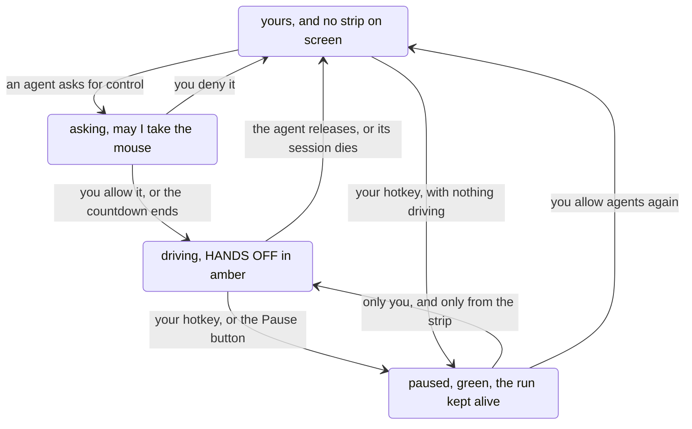

# The desktop is the agent's, and you can tell at a glance

> **In short.** Some jobs need your real pointer and keyboard. While one is
> running, a strip above every window says HANDS OFF and names what is happening
> right now. Its presence is the entire signal, so it has no idle state and no
> close button, and one key takes the desktop back without ending the run.
>
> **Read on if** an agent touching your actual mouse is the part you cannot get
> comfortable with. **Skip to** [[Taking turns|taking-turns]] for the resources
> that are not your desktop.

While the strip is up, the desktop is the agent's. It is state, not a card:
it never needs dismissing and never queues.

Pause inverts it and keeps the run alive. Nothing an agent can call
resumes it.

## A sign that is on screen for exactly as long as it is true

Top centre, below the system bar, 620 by 62 pixels, amber. It reads HANDS OFF, and
under that the line the agent keeps updating with the age of that line beside it:
`renaming the staging secret in the console · 4s`. If the age climbs and the words
do not change, something is stuck, and you know that without touching anything to
find out.

It appears when an agent opens a run and it goes when the run ends. There is no idle
state, it is not in the taskbar, and it has no close button, because dismissing a
sign like this one is only a way of lying to yourself about whose desktop it is.

It never takes focus, because it arrives while you are typing.

The driving is your keyboard, not an API, and that is more literal than it sounds.
With a second keyboard layout active, a release tag typed into a card as `2026.7.3`
arrived as `2026ץ7ץ3`, on camera. Since 2026-07-28 every synthetic key press locks
the layout it planned for before it types.

## Why a card could not do this job

On 2026-07-31, after interrupting a drive sequence three times in ten minutes:
"we need a better way of interacting, a permanent on-screen sign that means 'hands
off' for me. Otherwise I keep interrupting you and we work against one another."

The announcements available then were events. One card said "I am about to take the
mouse" and closed; another said "the mouse is yours again" and closed. Between
them there was nothing on screen, so the only way to find out whether an agent was
still driving was to touch something, which is precisely what breaks the run. That
session lost two drive sequences to a window that went to the background because he
typed in the terminal.

It was tried the other way round, and the record of it is short. A session that
needed the desktop for a screenshot run hand-rolled a confirmation card asking him
to keep his hands off, and got interrupted mid-run anyway. A card is answered and
gone; the driving goes on for minutes afterwards.

Two rejected alternatives, both for the same reason. A bottom-right pill truncates
the activity sentence and shares that corner with AgentBox's own toasts. And an
always-on strip with a quiet idle state would make presence ambiguous, which is the
one thing this element cannot afford: on screen means the desktop is not yours,
gone means it is.

## Taking the desktop back mid-run

<kbd>Ctrl</kbd> + <kbd>Alt</kbd> + <kbd>Esc</kbd>, or the strip's own Pause
button. The same window inverts to green and reads `PAUSED - YOURS`, with the
frozen activity line still readable in italic so you can see what it will go back
to.

A drive in flight parks rather than fails. Moves, clicks and drags finish the step
they are on, since stopping mid-drag is what leaves a button held down, but a
`type` step parks between characters, so a whole word never lands in whatever you
have switched to. Watched on the real desktop, a parked drive held for 21.45
seconds with the pointer frozen, then ran its two remaining steps to the exact
pixel on resume.

Nothing an agent can call resumes it. If an agent could, the pause would be a
suggestion. The latch is desktop-wide as well, so a second agent's request waits
for you rather than being handed the desktop the moment the parked run lets go.

A pause never ends by itself. Past two minutes, with an agent genuinely parked
behind the latch, the strip stops saying the desktop is yours and starts saying
`AGENT WAITING` in amber, because a counter quietly climbing is not a thing
anybody reads. At three minutes one card arrives, once, and it carries a single
button that resumes. Nothing on it ends the run: the agent's own wait gives up
after ten minutes and is told the desktop is the human's with its run intact,
which is a gentler end than cutting it off part way through a sequence.

Latching an idle desktop works too, and is worth having on its own. The strip
appears in green saying nothing is driving and that agents are held off until you
release it, and the button reads Allow agents rather than Resume.

A paused human is never asked for permission. A request for the desktop that
arrives while the latch is on parks silently, with nothing on your screen, and only
starts its countdown once you have resumed. You paused because you needed the
desktop, so "may I take the mouse?" is the wrong question at the worst moment.

## Who may move it, and who may not

Every arrow touching Paused is yours, in both directions. The agent's own moves are
the request and the release, and the release is two things at once: if its session
dies the run dies with it, because a strip that outlived its agent would claim
hands-off for a process that is gone.

Denying costs the agent nothing but the answer. The request blocks, silence grants
it, and a denial comes back as a refusal rather than as an error.

## Four pixels, for when you are recording

The rule that the sign cannot be dismissed was written against a human waving away
an inconvenient warning. Recording your screen is a different reason, and it needed
a different answer: not a hide, a demotion.

<kbd>Ctrl</kbd> + <kbd>Alt</kbd> + <kbd>Q</kbd>, or `agentbox control quiet`, drops
the strip to a line four pixels tall along the very top edge of the screen. Colour
is the only thing it can still say, and it says the important half: amber while an
agent drives, green while you have it paused. Four pixels crops out of most
recordings and reads as a window-manager accent in the rest.

Demoted, it also gives up being topmost, which is a real relaxation and was asked
for as one. A fullscreen window over the top edge covers it completely, and a
recording of that window has nothing of AgentBox in it. The mode is not persisted,
dies with the daemon, and a 30-minute fuse takes it back to loud, because a
recording mode left on afterwards is a hands-off sign nobody can see.

Cards go quiet with the sign, and that turned out to be a mechanism of its own.
They queue instead of appearing, drain the moment it goes loud, and the progress
window closes and comes back where it got to. The earcon still plays, because a
chime does not land in the take. [[When it stays quiet|staying-quiet]] has the rest
of that story.

## What it will not do

It is a sign and a latch, not a permission wall. An agent can drive the desktop
without opening a run at all, and nothing here refuses it. What the latch gates is
every script, run or no run, which is the half with teeth. Every driven step goes
through the daemon so one place knows it happened, logged as its shape and never its
text, because a typed step can carry a password. Whoever holds a run also wears a
chip saying so on [[the agents board|agents-board]], which is where you look when
the sign is down to four pixels.

An agent that forgets to release holds the desktop until something releases it. The
run does not end when the call that asked for it returns, which is what lets one
agent drive across several calls, and it means a forgetful one leaves the strip up
until its session ends.

Over a genuinely fullscreen window the strip stays on top rather than stepping
aside: this window manager layers a notification window above a fullscreen one
whatever the stacking order asks for. Left as it is on 2026-08-06, deliberately,
because a sign over a film is a smaller problem than a film with no sign. Recording
mode is the way out.

**Next:** [[the board that says which agent is driving|agents-board]], or
[[why a question never steals your keyboard|the-card]].
