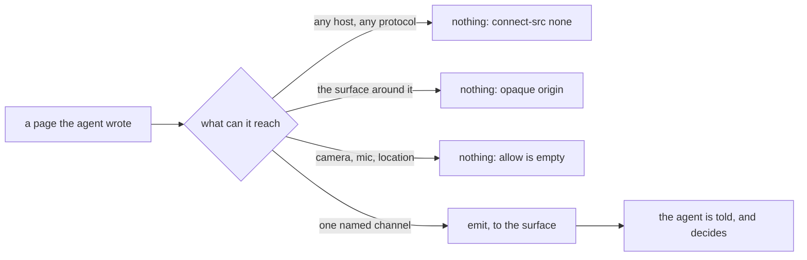

# Three questions, and the code that answers each one

> **In short.** A secret you type goes into a `0600` file and the agent is handed
> the path, never the value. Anything an agent wrote runs with no network at all.
> Nothing listens on a network port: one unix socket, in a directory created
> `0700`, with the peer's user id checked on every connection (on Linux and macOS -
> Windows cannot, and the box below says what that costs).
>
> **Read on if** you have to approve this on a work machine. **Skip to**
> [[Install|install]], or [[Limits and non-goals|limits]].

Three questions decide whether a tool like this goes on a company laptop, and none of
them is answerable with a promise. So each answer below names what enforces it.

The last section is the same thing as a list you can run yourself.

## A secret goes to a file, and the agent is handed the path

The destination is on screen before you type. The field is empty on purpose:
the promise is about where the value goes, and it is already made.

The card is a masked field, and it prints the destination underneath: `written to`,
then the path. What you type does not go back through the tool call that asked for
it. The MCP server picks that file before the card is even drawn, in a `secrets`
directory under your runtime directory with a random name, and what the agent
receives is `provided: true` and the path.

The result type has no field for a value at all. That is the part worth checking,
because it means there is no code path where a value could ride back through an
agent's transcript.

One exception exists, and it is on screen rather than hidden. A caller from your own
shell can pass `--stdout` to get the value instead of a path, and the card then reads
`returned to the agent's context` in the warning colour where the path would have
been. No MCP tool can ask for that. The tool's input has no such field.

The file is opened at `0600`, and chmodded to `0600` again in case something had
already created it, inside a directory made `0700`.

The value is never stored. It rides one in-memory field into the reply and stops
there. What the inbox reads back afterwards is that a secret was provided, by way
of the item being answered, and never what the secret was. The log line says
`secret.written` with an item id and a path.

A secret card also has no undo grace. Every other answer collapses into a strip that
counts down three seconds so you can take it back; this one delivers the moment you
submit, because holding a credential on screen for three more seconds buys nothing.

> [!CAUTION]
> Nothing in AgentBox deletes that file afterwards. The value sits at `0600` in the
> runtime directory until the directory itself is cleared, which on a systemd desktop
> session means when you log out. If it needs to be gone sooner than that, delete it.
> The path is the whole thing the agent was given.

## What an agent wrote cannot reach the network

An artifact is a page an agent wrote and you operate: a slider, a form, a small
console. It runs, which is both the point of it and the thing to be careful about, so
it runs inside a frame with two attributes and one policy.

The frame is `sandbox="allow-scripts"` with no `allow-same-origin`. That gives the
document an opaque origin: it cannot read the surface around it, cannot touch a
cookie, cannot open a window. Its `allow` attribute is the empty string, so no
camera, no microphone and no location are delegated to it.

The policy is `default-src 'none'` with `connect-src 'none'`, and nothing in it
permits a network fetch: the directives that exist for images, media and fonts allow
`data:` and `blob:` and nothing else. Not a CDN, not an XHR, not a websocket, not a
remote image. Which is also why React and Tailwind are injected into the document as
text out of AgentBox's own build rather than fetched: a page with no network cannot
go and get its own libraries, so they have to be in it already.

`unsafe-inline` and `unsafe-eval` are in that policy on purpose, and better read here
than found in a scan. The document is agent code. Refusing it `eval` would not make
it any less able to run what it already contains, and would break any library that
compiles a template at runtime. The policy is there for the network, and the network
is shut.

The one way out is the named channel in the diagram. The artifact calls
`emit(name, data)`, and the surface accepts that message only from a frame it is
already holding a reference to, and only in a fixed vocabulary of message types.

So an artifact can ask the agent to do something. It cannot do it.

## An image in agent prose may name a local file and nothing else

Card bodies are real markdown, so an agent can put an image in one and choose where it
comes from. Rendered the ordinary way, that is a request the surface makes on an
agent's behalf, to a host you never saw.

Raw HTML never reaches a surface, so `` cannot be hand-written at all. A markdown
image whose destination carries any scheme other than `file:`, or begins with `//`, is
not fetched: it renders as a marked placeholder that keeps the alt text and says why
it is not there. A local path has to be absolute, and then the
file is read by Go and inlined as a data URI, so the surface receives bytes and never
learns how to open a path at all.

One exception, for a document that is a file on disk: there a relative path is read
against that file's own directory, because that is what it meant to whoever wrote the
file. Prose arriving over the socket gets no such base, because the daemon's working
directory is not the agent's.

Those bytes are then typed by their own magic number rather than by the extension,
against a list of four: PNG, JPEG, GIF, WebP. The extension is the part of a
destination an agent is most likely to have got wrong, and the part an attacker
would choose.

SVG is left out on purpose. A vector picture from an agent is a chart fence or a
mermaid fence, both of which AgentBox draws itself, and neither of which needs a
parser for somebody else's XML.

The surface's own document carries `img-src 'self' data: blob:`, so if some future
edit ever did emit a remote source, the browser would still refuse to load it.

## Nothing is listening on a network port

One unix socket, in the per-user runtime directory. The only listener call in the
tree is `net.ListenUnix`. There is no TCP listener, no HTTP server and no port
number anywhere: a grep for `http.ListenAndServe`, `net.Listen("tcp`, `ListenTCP`
and `http.Server` across the non-test tree comes back empty.

There is one `http.Handler` in the code, and you should hear about it here rather
than find it in a review. It hands the embedded UI files to the webview. Nothing
ever binds it to a port.

Access control is the directory and then a check per connection. The runtime
directory is created `0700`; the socket file itself takes its mode from your umask,
which is why the directory is the control rather than the file. Every accepted
connection has its peer's user id read out of the kernel and compared with the
daemon's own before one byte is served - `SO_PEERCRED` on Linux, `LOCAL_PEERCRED` on
macOS. A mismatch is logged as `ipc.rejected` and the connection is closed.

Not once at startup, and not by trusting a file mode. On every connection.

> [!WARNING]
> **On Windows there is one lock instead of two, and this is the only place in
> AgentBox where that is true.** Unix sockets exist on Windows and AgentBox uses one,
> but the kernel records no credentials for them and offers no call that asks - so
> the second check cannot be made there. What remains is the first: a directory only
> your account can open, which is the same first line of defence every platform has.
> The fix is a connect token, a secret in a file only you can read and presented on
> every connection, and it is a protocol change rather than a patch. It is tracked as
> R-46 and `internal/server/peer_windows.go` states the gap at the point where the
> check would be. Nothing about the Linux or macOS behaviour changes.

## No account, no telemetry, and a log that holds shapes

There is nothing to sign up for, no licence check and no usage reporting. The only
network call in the tree is a dial to that unix socket. There is no HTTP client in
AgentBox at all.

> [!IMPORTANT]
> Two boundaries, so nobody finds them later. `make bootstrap` downloads a speech
> voice once, from a URL written in the recipe you are running. And a session or an
> assignment that AgentBox starts is a `claude` process: AgentBox opens no socket on
> its behalf, and that process then talks to whatever it normally talks to.
> AgentBox is the last meter between you and an agent, not a firewall around it.

The log is JSONL under your state directory, the file at `0600` inside a directory
at `0700`, rotated once when it passes the size you set. The line for an arriving
item holds who asked, what kind it was, its level and its title. Not the body.

"The log holds nothing" would be false, so be accurate about the rest. A resolved item
records the option you chose and any words you typed as a reply, which is the audit
trail working as intended. What never reaches it is an item's body, a secret's value,
and the text a driven script typed.

The line that matters most records a driven desktop script as its shape.
`window,move,click,type` is what lands in the log, one step name per line, and never
the text those steps typed: a `type` step can carry a password, and a log that leaks
one is a log nobody can keep. The tool says so to the agent in its own description,
which is how an agent knows it may drive a password field at all.

## Check these yourself, in about two minutes

- [ ] `ss -ltnp | grep agentbox` prints nothing
- [ ] `grep -rn 'net.Listen' --include='*.go' . | grep -v _test` shows one call, and
      it is `net.ListenUnix`
- [ ] `ls -ld "$XDG_RUNTIME_DIR/agentbox"` shows `drwx------` and your own name
- [ ] `grep -n "default-src\|connect-src" frontend/src/lib/artifact-runtime.js`
      shows both of them as `'none'`
- [ ] ask an agent for a throwaway secret, then `grep -rF` that value over
      `~/.local/state/agentbox` and find nothing

If any of those comes back differently on your machine, that is a bug rather than a
documentation choice, and it is worth saying so.

**Next:** [[what it refuses to become|limits]], or
[[getting it onto a machine|install]].
