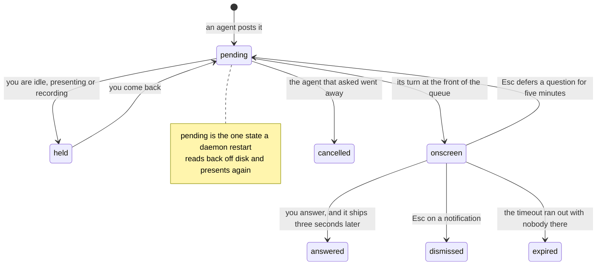

# The questions you were not there for are still waiting

> **In short.** Everything an agent put on your screen is in one list: the
> questions still waiting on top, answerable from the keyboard, then the day's
> history with what each one cost you. Nothing is clipped there, and an item that
> closed on its own timer while the desk was empty says so in its own row.
>
> **Read on if** you leave agents running while you are in a meeting. **Skip to**
> [[When it stays quiet|staying-quiet]] if what you want is fewer interruptions
> in the first place.

## Pending on top, because that is the part that still costs you

The inbox is an ordinary window with two sections. **Pending** first, then
**Recent**: who asked, what for, when it arrived, and how it ended. The split is
decided before the list reaches the screen, so a question can never sink below
the answered noise.


One search box covers title, agent, project, kind and outcome. There is no level
filter and no per-agent dropdown, which is a smaller surface than it sounds: typing
`release-bot` beats finding a menu, and every row already carries its level as a
coloured edge. The footer counts the day, `7 interruptions today`, beside a hint
line naming the keys that work right now.

## The same answer keys, on a list instead of a card

<kbd>j</kbd> and <kbd>k</kbd> walk the pending run, and the hint under the
selected row names its keys in that item's own words instead of in general
terms: `1 eu-west · 2 us-east · enter dry run`. Digits choose, <kbd>y</kbd> and
<kbd>n</kbd> confirm, <kbd>Enter</kbd> takes the default, <kbd>c</kbd> copies the
whole item ready to paste back at an agent. Answer one and the selection lands on
the next, so a queue built during a meeting clears without the mouse.

That vocabulary is decided in Go rather than in the window, which is what stops
the list and [[a question on screen|the-card]] drifting apart as either one
grows.

Two keys do differ, and knowing which saves a wasted press. Dismissing is
<kbd>d</kbd> here and <kbd>Esc</kbd> on the card. Stopping a countdown is
<kbd>s</kbd> here and <kbd>Space</kbd> there. Anything that needs you to type
refuses to be answered in a list at all: <kbd>Enter</kbd> raises its real card
instead.

## A 946-character body that could not be read back

On 2026-07-31 a countdown card came up while the desk was empty and expired on
its own. Boris went looking for what it had said: "I've missed what you said - so
I tried to look in the inbox and there doesn't seem to be a way to find it - this
is a problem. I can't see the whole thing you wanted to tell me."

He was right, and the reason was a decision that had looked reasonable in writing.
A row carried title, identity, age and outcome, and the body only as a hover
tooltip on a resolved row, which truncated at 140 characters. The repo's own status
file listed it under deliberate gaps: no per-item detail, promote it to a card to
read the body. Promoting was not offered for an item that had already ended.

For a tool whose whole purpose is that a message is not lost, losing the message is
the wrong failure.

Since 2026-08-05 every row opens a detail underneath it, through the same renderer
the card used, so it reads the way it read on screen. Above it, both timestamps and
how long the item stood. Below it, what was offered and which option went back,
with the default and the taken one marked separately. Nothing is clamped, shortened
or ellipsised.

The card that started it was a veto with a 946-character body. Its row says
`proceeded` and shows 140 characters. Opening it gives back the whole thing,
rendered, under `arrived Aug 5 15:02, ended Aug 5 15:02, stood 8s`.

## Everywhere an item can be while you are not looking



A restart is the interesting branch. Pending items come back out of the store in
arrival order, and a burst that was collapsed into one summary comes back
collapsed, not as fifteen fresh cards.

What does not come back is the caller. A blocking question whose agent process is
gone reads as waiting for a caller that reconnects, and an answer you give it is
recorded in the history without reaching anybody. Better than pretending, and
worth knowing before you spend a keystroke on it.

## What is kept, and what was never written down

Resolved items are pruned once, at daemon start, and only below a level you set.
The defaults keep 30 days of everything, and keep warnings, errors and anything
urgent for good. Pending is never pruned at any age, which is the rule this page's
title rests on.

| What | What happens to it |
|---|---|
| a pending item | kept until it is resolved, whatever its age |
| a resolved warning, error or urgent | kept, at the default `keep_level` |
| a resolved info or success | evicted after 30 days |
| a credential | the history records that one was provided, never the value |
| a line said with `agentbox say` | never written down at all |

<sub>Set `keep_level = "info"` and nothing is ever evicted. Setting
`retention_days = 0` does not mean forever: it falls back to 30.</sub>

A line said on its own is not stored, because saying something out loud was never
an interruption to triage later. A line attached to a card is a different thing, and
that one is kept and read back under `Said out loud`.

Then there is the arithmetic of the day, which is the part that changes behaviour:

```sh
agentbox stats --since 7d
```

Totals, how many of them blocked an agent, how many you answered, and the median
time you took, broken down per agent and per day. It is usually one agent.

**Next:** [[how to make the noisy one stop|staying-quiet]], or
[[the five levels and the sounds they make|notifications]].
