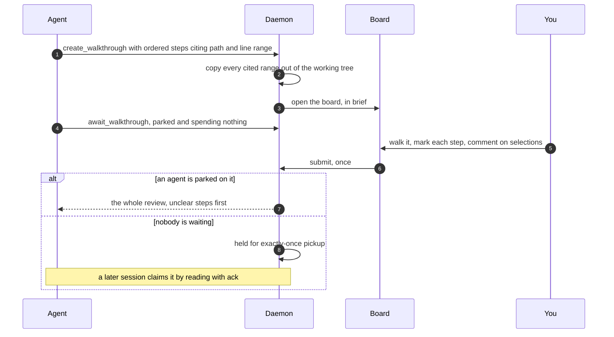

# Review a change once, at your own pace, and answer it in one turn

> **In short.** An agent hands you an ordered walk through a change: a station at
> a time, the code beside the explanation, comments anchored to the exact lines you
> highlighted. You mark each step understood or unclear, then submit once, and the
> agent gets the whole review with the unclear steps at the top.
>
> **Read on if** reviewing an agent's work currently costs you twenty round trips.
> **Skip to** [[Documents and artifacts|documents-and-artifacts]] for the same
> rendering without the review around it.

## A change with a route through it

Reviewing a body of work with an agent degrades into one exchange per remark. The
agent raises a location, you react, it responds, and again. For a feature-sized
change that is dozens of turns, you lose the thread somewhere in the middle, and
the agent never once sees the review as a whole.

So the direction is inverted. The agent submits a structured route and AgentBox
draws it: ordered steps, each with the question it answers, the code it cites and
the checks worth running. Then you walk it alone.

```sh
agentbox walkthrough open
```

With no id that opens the most recent review, marks and reading position intact.
The rail down the side shows every station at once, the current one marked, with a
running count of how many you have judged. That count is the promise the surface
rests on: this is finite, and nothing may grow it mid-walk.


<sub>The comment carries the exact file, the exact lines and the exact text you
highlighted.</sub>

Only one of the four step kinds is code. A ground step carries the vocabulary and
does not count toward the total, and a check step is a command with an expected
result.

A step may also say there is nothing here to review. That sounds like filler until
you have spent twenty minutes hunting for files that do not exist.

Past about eight steps the rail groups into as many as six domains and opens one at
a time, so the shape of the whole review stays visible while only your part of it is
detailed. <kbd>[</kbd> and <kbd>]</kbd> move between them, and clicking a collapsed
domain opens it without taking you there. Looking ahead is a different act from
going.

The board opens in TL;DR, from one sentence on 2026-08-06: "The content in TL;DR is
not necessarily less exhaustive, but it is to be optimally structured for a person
with a very short attention span that must still get a mastery level of the most
important aspects discussed." So it is not a summary field. Nothing important is
cut; what changes is the shape. <kbd>t</kbd> switches to the full text, and a step
written before this existed says so instead of showing you an empty pane.

## The prose lights up the lines it is talking about

The explanation and the code are two regions of one screen, and holding the
connection between them is work the reader should not be doing. So an agent can
bind a phrase in its prose to a region of code: read "the guard on the second
branch" and the guard lights up. No prose may name a line number, and the validator
refuses one outright, because a number in a sentence is a fact with a shelf life of
one edit.

The agent's own explanations sit numbered in the margin beside the lines they are
about. The reason a line matters is next to the line, not in a paragraph you have
to leave the code to read.

Domain words get a quiet dotted mark on their first appearance in each step, and
<kbd>g</kbd> opens a glossary drawer over the page. Popping a definition on hover
was raised and rejected in the same breath as distracting, and the drawer overlays
rather than taking a column, because opening a definition must not reflow the
paragraph you are in the middle of.

<kbd>a</kbd> reads a step's opening aloud, and each prose region has its own
control: the opening, every block's handover paragraph, the takeaway, the checks.
Code blocks are deliberately not read, because reading punctuation and identifiers
aloud is noise. There is play and stop and nothing else, which is what survived
being built with a full transport first.

## A review has to keep the code it is about

On 2026-08-01 a board came up reading `cannot read cmd/ssvc-backfill/main.go at
the pinned path`. Boris: "I thought the code is embedded and not read each time.
This means whenever the code changes, the walkthroughs that were based on it get
invalidated."

He was right, and the failure was worse than the error on screen. A review stored
the citation and the diff and nothing else, and the renderer read the file off disk
every time it drew. That gives three outcomes. A deleted file is an honest error. A
file now shorter than the cited range is an honest error. A file edited in place
and still long enough renders **whatever now sits at those line numbers**, under
the original prose and the original margin notes, and says nothing at all. A review
that reads as true and is not.

The commit was supposed to prevent this and could not: it was validated as hex,
printed in the header, and read by nothing.

Creation now copies every range it cites out of the working tree the authoring
agent was reading. The board prefers that copy and falls back to the live file, and
each block's header says which one you are looking at. The rejected design was to
read the code out of git on every render, which sounds more correct and is not: a
clone can be deleted, moved or garbage-collected, and the review should outlive it.
Git is the repair path instead. `agentbox walkthrough repair` recovers reviews
stored before the change, from the commit the spec pinned, which is the first and
only job that commit has ever done.

## Unclear is the verdict the whole thing exists for

Every step takes one of two verdicts, <kbd>u</kbd> for understood and <kbd>x</kbd>
for unclear, plus a closing note in your own words at whatever length the step
deserves. Understood may stay silent and is marked as unsaid when it does. Unclear
may not: a submission carrying an unclear step with no note is refused and told
which step, and the refusal lives in the daemon and not the window, so no
surface can talk its way past it.

The set of unclear steps is the entire product. Everything else is bookkeeping, and
a bare `unclear` label the agent has to guess at is the one way this fails while
appearing to work.

Comments are anchored, not described. Select lines inside a code block and the
composer opens at the selection instead of at the bottom of the step, and what the
agent receives is the file, the side of the change, the line range and the exact
text you highlighted. That last field cost a real bug: the browser engine's own
selection includes the line-number gutter, so the first field-tested anchor came
back with line numbers baked into the quoted code. The rows are read directly now.

A remark about the whole step, not a range, is the same record with no file on it.

## One submission, and the unclear steps come first



The payload is structured data in reading order, and the unclear set is its own
field ahead of the full walk rather than something the agent has to filter for.
With it go the tally, every comment with its anchor, which comprehension answers you
revealed, what the checks actually printed, and a `not_reviewed` list that is always
present so silence can never be read as approval.

The receipt matters as much as the payload. The board says whether an agent took it
in that instant or whether it was saved, and if it was saved, that the next session
to read the review takes it exactly once. A review with no verdicts at all asks a
second time before it goes.

## What it refuses to do

It will not let an agent amend a review. `amend_walkthrough` is registered, its
description says it refuses, and it refuses: the answer is a fresh review, while the
old one keeps its marks and stays in the library. If a submission is sitting unread
the refusal is more specific, because amending then would overwrite a handback
nobody has seen.

The agent's replies have no home in the board yet. You submit, and the answers come
back the way any other agent output does, not next to the comments they answer.

And the capture is taken from the working tree without checking that the tree
matched the commit the spec pinned. Right on a clean tree, quietly a different thing
on a dirty one. Comparing the two at creation was left out to keep it free of a git
subprocess, and it is the next obvious thing.

**Next:** [[the reading window this is built on|documents-and-artifacts]], or
[[who is waiting on you right now|agents-board]].
