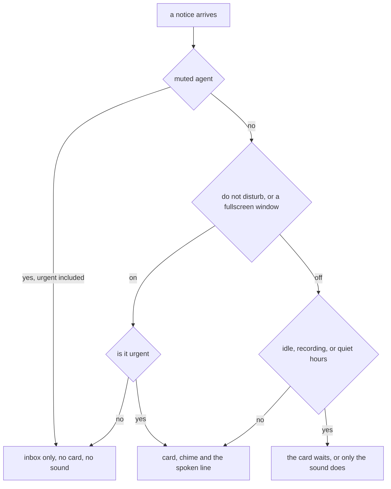

# Every way to make it shut up

> **In short.** Do not disturb, one muted agent, quiet hours, and a gate that
> notices you are idle or presenting without being told. Urgent is the only level
> that walks past do not disturb, and there is a knob that closes that door too.
> Nothing any of them touches is discarded.
>
> **Read on if** you have been burned by a tool you could not turn off.
> **Skip to** [[Away, and nothing lost|nothing-gets-lost]] for where the held
> ones go.

A notifier you cannot silence gets uninstalled. There are five ways to be left
alone here, they compose, and the two that matter most are the ones you never
switch on.

## Off for the next hour, and it will tell you what is holding things

`agentbox dnd on` is the blunt one, and so is the tray checkbox beside it.
Everything queues silently, the tray icon dims, and switching it off again reveals
what came in with a single chime instead of the backlog's worth. Urgent still gets
through, because a level nothing can pierce is a level nobody will use for the thing
that deserves it, and `urgent_breaks_through = false` shuts that too.

The part worth knowing is what `agentbox dnd status` prints. It reports the switch,
and then, if something else is holding your notices, it names that instead:
`a fullscreen window is focused ([presence] fullscreen_auto_dnd)`. A status line
saying "off" while notices are being held is how somebody concludes a tool is
broken.

## Mute the one agent that will not stop

One agent in a loop should not cost you the other three.

```sh
agentbox mute dependency-bot
agentbox mute --list
```

A muted agent's items go straight to the inbox: no card, no sound, no spoken line,
and no exception for urgent. That is the one place urgent loses, and deliberately.
Do not disturb is a statement about you, so urgent overrides it. A mute is a
statement about that agent, and an agent you have muted is not the one to trust with
the escalation hatch.

Mute matches the agent's name, not the project, and it lives in memory. A
restart makes everyone audible again, which is the right default for something you
reached for in irritation.

## It already knows when you are not there

Two signals arrive without you doing anything. After 120 seconds with no input the
desk counts as empty, and the chime is then held while the card still goes up: no
point ringing in an empty room, and no point hiding a question from a screen nobody
is reading. Come back and you get exactly one summary chime, not one per item.
Escalation pauses meanwhile without spending its five replays.

The other is fullscreen. Something fullscreen on the focused monitor is treated as a
presentation or a screen share and turns on the same gate the switch does,
credential prompts included. Your desktop's own do-not-disturb is read as well,
though only on GNOME. Elsewhere that signal is absent, and an absent signal always
reads as "you are here" rather than as permission to go quiet.

## Recording mode is quiet in the picture, not in the room

None of the above fits the case Boris raised on 2026-08-06: "The hands off panel
should also be hidable for cases when we need to record the screen and don't want it
to be shown over the recording." Until then he recorded with a 620x62 amber card
pinned over the top of the frame, or did not run agents while recording at all.

Hiding it was the wrong answer, because the sign says an agent is driving the desktop
and a viewer of the recording arguably needs that more than anyone. So it is a
demotion. <kbd>Ctrl</kbd> + <kbd>Alt</kbd> + <kbd>Q</kbd> drops
[[the hands-off strip|hands-off]] to four pixels along the top edge, and those four
pixels give up being top-most so a window can cover them. The guarantee is weaker in
this mode because it was asked for that way.

The whole top-centre column goes with it. Cards queue, the progress window closes,
and urgent waits too but is inserted at the front, so going loud shows the question
an agent is parked on instead of the oldest build notice.

The earcon still plays, and that is the line between this and do not disturb: the
picture goes quiet, the room does not, so you are not recording blind. The spoken
line is the one thing held back, because speech is the loudest thing AgentBox does
and it lands in the take.

The mode expires after thirty minutes and dies with the daemon, since a recording
mode left on is a hands-off sign nobody can see.

## One session flooding you becomes one card, and drops nothing

Past 3 items in 10 seconds a session stops getting a card each, and everything over
collapses into one warning-level summary: `dependency-bot: 14 notifications in 20s`,
listing the four newest, <kbd>e</kbd> for the rest. Newest first, which is the
opposite of the stored order, because what an agent said last is what its burst is
currently about.

The collapse is a display decision and only a display decision. Every row under it is
still a real pending item. A question caught in the burst says `waiting on you` in
the list and opens as its own card by click or by number key, and the call behind it
is parked exactly where it was: a blocking agent gets neither a faster answer nor a
worse one for having noisy neighbours. It gets the same one, later. <kbd>Esc</kbd>
dismisses the summary, and the footer says what that costs first, since the
notifications go and the questions stay.

The budget is keyed on the session rather than the agent name, which matters on a
machine where every session calls itself the same thing.

## The gate chain, and the one gate urgent skips



That last branch is three different trades. Idle holds the sound and shows the
card. Recording holds the card and plays the sound. Quiet hours hold every sound
including urgent and show every card, because quiet hours were only ever about the
room.

> [!IMPORTANT]
> A gate holds the picture, not the clock. A question with a timeout expires on
> schedule while it waits behind any of these, and a countdown that proceeds unless
> you stop it will proceed unseen. If an agent is about to do something you would
> want to veto, do not disturb is not a pause button.

**Next:** [[what happens to everything that was held|nothing-gets-lost]], or
[[the levels and the sounds themselves|notifications]].
