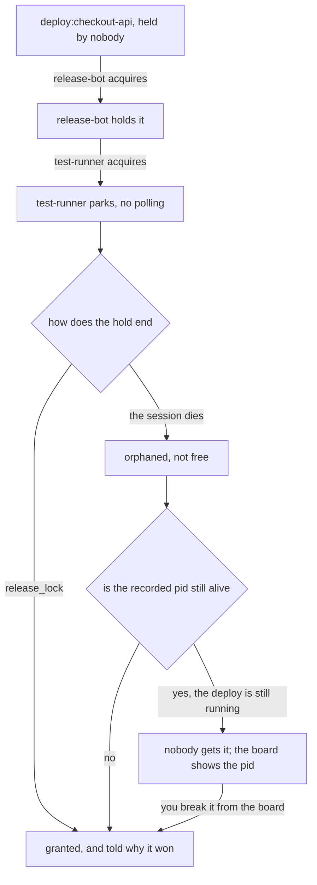

# Your agents can wait for each other instead of asking you

> **In short.** Two agents in one checkout will eventually write over each other.
> Locks, signals and a small shared blackboard let them take turns, wake each other
> and split work without routing every decision through you. Every wait is one
> parked call inside the daemon, so nothing polls and nothing spins.
>
> **Read on if** you have ever answered a card that meant "wait, the other session
> is deploying". **Skip to** [[Who needs you now|agents-board]] to see the same
> thing from the outside.

## The hour that cost two commits

Two agents were working in one checkout on 2026-08-04. Inside one hour, a
catch-all `git add` swept somebody else's unfinished document into an unrelated
commit, and a `git reset` dropped their finished commit off main.

Neither agent did anything unreasonable. Neither could see the other.

Before this existed, the workaround was a card asking a human to sequence them:
"wait, the other session is deploying". That is the human being used as a mutex,
and it is the cost that argues for the feature. The rules a repo writes down
instead ("never run the deploy while somebody else is") are social locks, which
work exactly as well as everybody's memory.

## One call that parks until the resource is yours

A lock is a name and a call. `acquire_lock("deploy:checkout-api")` blocks until it
is granted, and while it is parked it spends no tokens and does no polling: the
call sits in the daemon and is woken by a channel send over a unix socket. The
name is a convention rather than a registry, in a `kind:scope` idiom, so
`deploy:checkout-api`, `repo:checkout-api` and `vm:build-box` need no setting up.

A timeout is a result, not an error, and it comes back with everything needed to
decide without a second call: who holds the lock, what their purpose and activity
lines say, how long they have held it, and how many agents are queued. `try_lock`
is the same picture, refused immediately, for a caller with something else to do.

Shells get the same lock, which is how hooks, Makefiles and agents that do not
speak MCP join in:

```sh
# nobody else on this machine gets the deploy while this runs
agentbox sync lock deploy:checkout-api --timeout 600 -- ./deploy.sh
agentbox sync locks   # who holds what, and who is queued behind them
```

Exit `0` granted, `1` refused or timed out. Waiters queue in order, and every
release says why the next one won: released, holder gone, or broken by you.

One resource deliberately has none of this. Your own mouse and keyboard are never
queued, because a hidden queue would hand them to an agent that has moved on, so
asking for a desktop somebody else is driving is refused rather than parked.
[[Hands off the desktop|hands-off]] is that rule and its sign.

## A dead session does not free a live resource



The branch through orphaned is the one nobody expects, and it is the whole reason
this is not five lines of code. When an agent's session disappears, what died is the
child process that was talking to AgentBox. That proves nothing about the work: a
`./deploy.sh` the session started keeps running after its terminal closes.

So a held lock goes **orphaned** rather than released. It keeps the pid it
recorded, waiters are told the holder is gone, and the grant happens when that
process is gone too or when you break the lock yourself. The obvious design,
release after a short grace, hands the resource to a second agent while the first
one's deploy is still writing to it, which is the failure the lock existed to
prevent.

Breaking a lock reassigns it. It does not stop the process, and the confirm on the
board says exactly that, because the two read as the same action and are not. The
agent you took it from is told at its next call of any kind, in a line that ends
"Your own work was NOT stopped".

> [!WARNING]
> Never hold a lock across a question to a human. The waiting agents are frozen
> for as long as you take to notice the card, and the one thing this feature is
> supposed to remove is you standing in the middle of it.

## Signals are stored, so nobody has to be listening

The second primitive is a message with durable pickup. `post_signal("tests:green")`
returns immediately. `await_signal(["tests:green"])` parks until something matches,
then hands back everything since your cursor in one batch, so an agent that was
busy while three signals fired catches up in a single call. Patterns take a prefix
(`done:*`), and every session has a private topic, which is how "message that
agent" needs no mailbox and no new tools.

Composition is the point. "Deploy when the tests are green" is one `await_signal`
followed by one `acquire_lock`: two calls, no polling, and the whole chain visible
on [[the board|agents-board]] while it happens.

Retention is where this got interesting. Signals are kept per topic, 1000 of them
or seven days, whichever runs out first, and a caller whose cursor has fallen off the trimmed edge is told
`gap: true` rather than handed a batch with a hole in it. The first version of that
check was wrong in a way that reads as obviously correct: it compared a cursor
against the oldest surviving sequence number. On a live daemon within an hour of
shipping, cursor 1, oldest surviving 1, sequences 2 and 3 already trimmed out of
the awaited topic, and the batch came back looking complete. What remains cannot
tell you what was taken, so the daemon now records the highest sequence retention
removed from each topic, and that watermark outlives the topic's own signals.

Silence must never read as "nothing happened". A batch with a quiet hole in it is
how two agents both come to own the same chunk of work.

## Ten workers over ten keys, and no chunk done twice

The blackboard is small named state with compare-and-swap: `get`, `set`, `delete`,
one tool, none of them blocking. The interesting argument is `if_version`. Versions
start at 1, so `if_version: 0` means "write this only if the key does not exist
yet", which is a claim.

```sh
agentbox sync set claims/chunk-7 test-runner --if-version 0 \
  || echo "somebody already has chunk 7"
```

The idiom is one key per item rather than one table under one hot key, so ten
workers over ten chunks never collide at all, instead of all ten retrying against
one crowded version. A losing
write is a normal outcome, not an error, and it comes back with the current value,
the version, the owner, and whether that owner is still running, because "somebody
was faster" and "somebody died holding this" call for opposite next moves.

That last field was bought with a defect the probe found and the diff did not. Ownership was checked against the roster, and the roster lives in memory, so
for the second it takes every session to redial after a daemon restart, every
owned claim read as abandoned. An invitation to take over a chunk somebody is
actively writing is the precise failure this primitive exists to prevent. The
owning process is recorded now, so a read answers in two steps: on the roster
means alive, otherwise the pid decides.

## What a lock is not

It is advisory. An agent that never calls any of this can still run the deploy
bare, and nothing here can stop it. Coverage comes from instructions, hooks and
wrapping the real commands, not from enforcement, and the board is how you see
whether it worked.

Everything is local to one machine and one daemon. `vm:build-box` is a name that
happens to describe a remote box, not a lock on it.

One shell caveat with teeth, measured on 2026-08-04: a foreground command from an
agent's shell tool is killed at exactly 120 seconds. Wrapping a real deploy in
`agentbox sync lock NAME -- CMD` from inside an agent therefore loses the command,
and the hold with it, two minutes in. Long jobs take the lock and release it as
two calls with `--ttl` covering the gap.

And there is one resource this daemon cannot arbitrate, which is the daemon.
AgentBox's own deploy stops it halfway through, and locks are memory only, so a
hold taken for that deploy would vanish at the worst possible second. That job takes an ordinary
file lock instead.

**Next:** [[the screen where you watch all of it at once|agents-board]], or
[[what happens when an agent needs your mouse|hands-off]].
