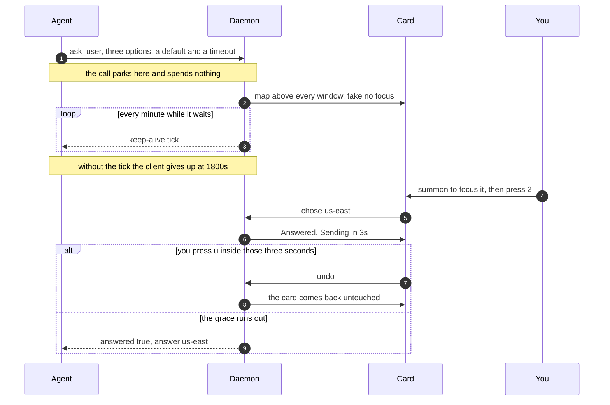

# A question on screen, answered in two seconds

> **In short.** A card is one blocking question from one agent, drawn dead centre
> of the monitor you are looking at, above every window, and it never takes your
> keyboard. Numbered options mean answering is one keystroke, and every answer
> waits three seconds behind an undo strip before it leaves.
>
> **Read on if** you want to know what answering one actually feels like.
> **Skip to** [[Sound and speech|notifications]] for the things that are not
> questions.

Every option carries its number. The whole exchange is one keystroke.

Top right, before you have read a word of it: what the Esc key on this
particular card will do.

## What is on it, and why the identity pill is so loud

Top left, in its own colour: who is asking. The pill is a hash of the agent and
the project, so `release-bot · checkout-api` is that colour on this card, in the
inbox row for the same item, and on the board. It is louder than a label needs to
be, on purpose. When four agents take turns interrupting you, the one thing you
must never misread is which of them is asking.

Down the left edge, a three pixel bar in the level's colour. Then the title, one
line, large. Then the body, which is real markdown: tables with columns, code with
highlighting, alerts, maths, a diagram, an image read off your own disk. A long
body scrolls inside the card, and a very long one folds behind a `?` so the
question stays visible above it.

At the bottom, the things you need in order to answer without thinking: how long
you have, which option is the default if you do nothing, and one dot per question
already queued behind this one.

## It will not take your keyboard, and that is the whole design

The card maps above every window and takes no focus. Your keystrokes keep going
wherever they were going.

To answer, you either click it or press the summon key you bound when you
installed it, which focuses it. Then single keys work.

That costs about 300 milliseconds and it buys the one failure this product refuses
to have. A card that grabs focus mid-sentence can swallow a password into a
question's text field, or let a stray keystroke answer something in production. A
stolen keystroke that answers a question by accident is worse than a question
answered slowly. There is no setting to make a card modal, and that is deliberate:
the caller who wanted one would be trading away the guarantee that lets every
other card appear while you are mid-sentence somewhere else.

Once it is focused:

| Key | What it does |
|---|---|
| <kbd>1</kbd> to <kbd>9</kbd> | choose that option |
| <kbd>y</kbd> / <kbd>n</kbd> | yes or no, on a confirm |
| <kbd>Enter</kbd> | take the default shown in the footer |
| <kbd>/</kbd> | reply in your own words instead of choosing |
| <kbd>u</kbd> | undo, while the answered strip is still counting |
| <kbd>c</kbd> | copy the whole item, ready to paste back at an agent |
| <kbd>?</kbd> | unfold a body that was folded away |

## Esc is two different keys, and it took a complaint to notice

On a question, <kbd>Esc</kbd> means defer: not now, ask me again in five minutes.
On a notification it means dismiss. Same key, opposite jobs, and the hint at the
top right of the card tells you which one this card's <kbd>Esc</kbd> will do.

It did not always. <kbd>Esc</kbd> deferred everything and
<kbd>Shift</kbd> + <kbd>Esc</kbd> dismissed, and the hint named only the first one.
Deferring is exactly right for a question. On a notification, which has nothing to
answer, it is a trap: the item stays pending, and at urgent level escalation raises
it again every twenty seconds.

Two urgent notices, 2026-08-06: "No matter how many times I press Esc, it pops
back up." He was pressing the only key the card named, and it was the one key that
could not end it.

> [!TIP]
> The hint line is honest about the current state rather than a fixed string. With
> a text field focused it stops naming single-key shortcuts, because pressing
> <kbd>c</kbd> would type a `c`.

## Three seconds in which you can take it back

The moment you answer, the card collapses into a strip that says what you chose
and counts down. Press <kbd>u</kbd> and the card comes back exactly as it was.

The answer leaves for the agent when the countdown ends, not when you press the
key. That is the difference between an undo and an apology.

One card has no grace at all, on purpose: a credential goes the moment you submit
it. Holding a secret in a window for three more seconds buys nothing and risks
something.

## The life of one question

The tick in the middle of that is not a flourish. Nothing ticked at all until
2026-08-04, and the consequence was that every blocking card sat on a
thirty-minute fuse: the client abandons a tool call that has been silent for 1800
seconds, so a card you answered at minute 40 sent its answer to a caller that was
already gone. Nobody had ever seen it happen, because seeing it requires leaving a
card up for half an hour and then answering it, which is precisely the case this
product exists for.

## Six shapes, one card

The card is one surface with six answer zones, so all of them behave the same way
and all of them take the same keys.

| The agent needs | You get | It comes back as |
|---|---|---|
| one of a few choices | numbered options with descriptions | the option, or your own words if you pressed <kbd>/</kbd> |
| your words | a text field, multiline on request | the text |
| a yes or a no | two buttons, <kbd>y</kbd> and <kbd>n</kbd> | yes or no, and exit code 0 or 1 from a shell |
| permission by silence | one button carrying a countdown: "Stop, pushing to main in 0:12" | proceeded, unless you pressed the brake |
| several related answers | up to six stacked fields, <kbd>Tab</kbd> between them | all of them, one round trip, one undo |
| a credential | a masked field that says where the value is going | a path to a `0600` file, never the value |
| a patch approved | the unified diff, coloured, scrollable, with Approve and Request changes | approved or rejected, plus any note you typed |

That is seven rows for "six shapes" because a diff card is a card with a patch
in it rather than a seventh answer zone.

There is one case where a question does not get a window at all. When the agent
asking is one running inside AgentBox's own session surface, the question appears
in that conversation, directly above the composer, wearing the severity bar a card
would have worn, because the thing the question is about is exactly what a card
would have covered. It still never takes the keyboard: the composer keeps it, and
the answer keys work only when you are not typing.

**Next:** [[what happens to a question you were not there for|nothing-gets-lost]],
or [[the five levels and the sounds they make|notifications]].
