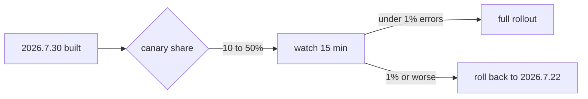

# Release 2026.7.30 - readiness

| Check | Result | Where |
|---|---|---|
| Unit and integration | 1,412 passed | `make check` |
| Contract tests against 2026.7.22 | 38 passed | `test/contract` |
| Migration `0119_region_index` | reversible, 41ms | staging |
| Error budget, last 7 days | 0.4% of 2% spent | dashboards |

The rollout is gated on the canary rather than on a timer, so a bad build is
withdrawn by the error rate and not by somebody watching a clock.



One constant decides it, compared against the same window on the old build:

```go
const canaryErrorCeiling = 0.01

func (c *Canary) verdict(new, old window) Verdict {
    if new.errorRate() > old.errorRate()+canaryErrorCeiling {
        return RollBack
    }
    return Proceed
}
```
