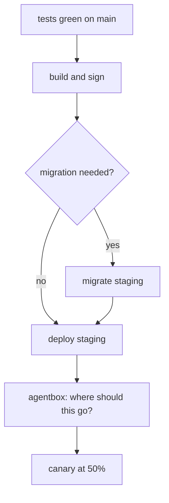

# Release report: 2026.7.3

This window is `show_document`. An agent wrote this file at the end of a job and
asked AgentBox to render it, and everything below is what agent prose gets for free:
headings, tables, alerts, mathematics, diagrams, charts, highlighted code and
images. **No terminal scrollback, no browser, no network.**

> [!NOTE]
> Nothing on this page fetched anything. An `` in agent prose can name a file
> on this machine and nothing else - the rule is in ADR-0010, and it is enforced by
> a test that runs a hostile document through every surface.

## What went out

| Change | Why | Risk |
| --- | --- | --- |
| API client now times out after 10s | A hung request pinned a worker for 40 minutes on Tuesday | low |
| Search index rebuilt from the new schema | The old index still had the pre-migration field names | medium |
| Staging TLS certificate rotated | The old one expires on Sunday | low |
| Two columns added to `orders` | Needed by the refund flow (reversible) | low |

## The error budget, which is why the canary was only half

A month's budget at three nines is about 43 minutes of failure. If $r$ is the
error rate on the new build and $s$ the share of traffic it takes, the budget it
can burn in an hour is

$$
b = 60 \cdot r \cdot s, \qquad r = 0.004,\; s = 0.5 \;\Rightarrow\; b \approx 7.2 \text{ min}
$$

so half the traffic for one hour spends about a sixth of the month if the new
build is as bad as the worst build this year. That is the number the slider was
really setting.

## The pipeline it ran



## What the week cost in interruptions

```chart
{"type": "bar", "title": "Interruptions per agent, this week",
 "x": ["release-bot","test-runner","dependency-bot","oncall-helper"],
 "series": [{"name": "asked", "values": [11, 4, 6, 2]},
            {"name": "answered", "values": [11, 4, 5, 2]}]}
```

## The fix, in the diff you approved

```go
// A request with no deadline can pin a worker until the process restarts.
func New(base string) *Client {
    return &Client{
        base: base,
        http: &http.Client{Timeout: 10 * time.Second},
    }
}
```

## An image, read off this disk

The path below is written relative to this file, which works because AgentBox opened
the file itself and knows where it lives. It reads the bytes and hands them to the
window; the window never asks a host for anything.


> [!TIP]
> `agentbox show --watch FILE` re-renders on every save, which makes this window a
> live preview of whatever an agent is writing.

---

Still open: the refund flow needs the new columns wired up, and the dependency
bot's one unanswered question is waiting in the inbox.
